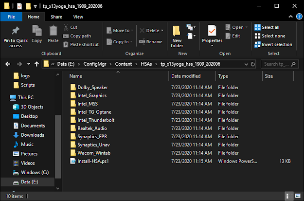
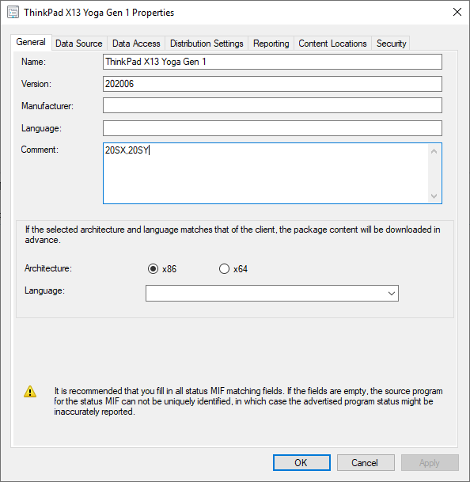
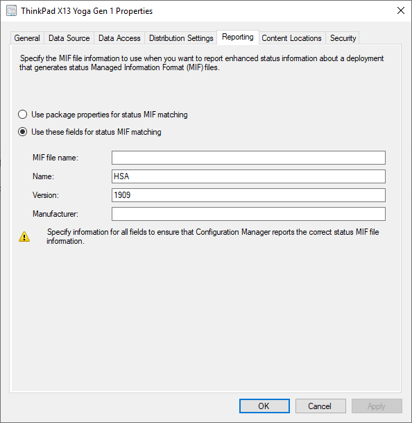
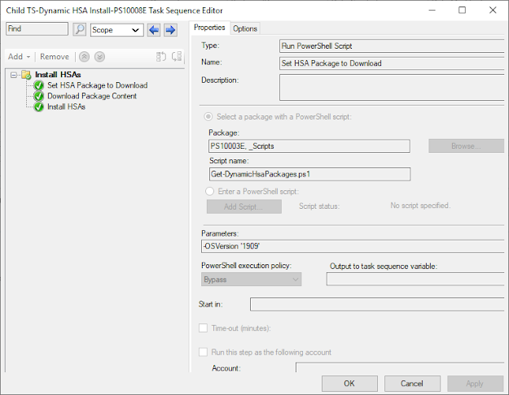
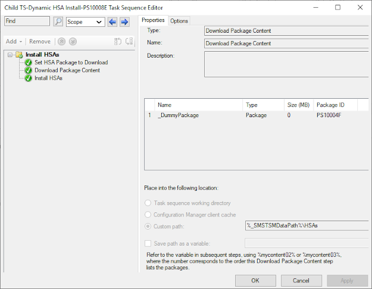
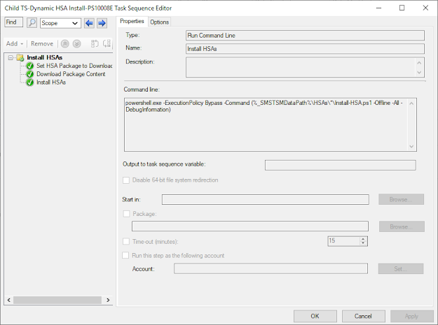

### Dynamically Install Hardware Support <br> Apps with ConfigMgr
*Author: Philip Jorgensen*

This article is intended to provide another solution to install the recently released HSA packs for your ThinkPad in a ConfigMgr Task Sequence.

For an in-depth overview of these HSA packs and installation script, refer to this [**article**](https://blog.lenovocdrt.com/2020/hsa-1.md).  

To make this process a bit easier and to reduce the number of steps in your Task Sequence, this solution goes hand in hand with an older post: [**Dynamically Updating BIOS**](https://blog.lenovocdrt.com/2017/dynamic_bios_update.md).

**Workflow**

We can achieve this in essentially 3 steps in a Task Sequence.  
- Set the correct Package to download for the applicable model (PowerShell script)
- Download Package to a custom path on the client
- Installation using the Install-HSA.ps1 script found [**here**](https://blog.lenovocdrt.com/2020/hsa-1.md)

---

**Step 1**: Download HSA Pack

First, you'll need to download/extract the contents of the HSA pack to a desired location and place the **Install-HSA.ps1** file in the top level directory.



**Step 2**: Create Legacy Package(s)

In the ConfigMgr console, create a Package (No Program) and enter the following details
- **Name** - Friendly name of the system.  For example, **ThinkPad X13 Yoga Gen 1**
    * This can be found in the deployment [**recipe card**(https://support.lenovo.com/solutions/ht104042) for the model
- **Version** - This is optional, but I entered the HSA pack version, which can be found in the ReadMe
- **Description/Comment** - This is the first 4 of the MTM.  For Example, **20SX,20SY**
    * Also found in the deployment recipe card



- **MIF Name** - HSA
- **MIF Version** - Windows 10 Build.  For example **1909**
    *The HSA pack will show which build of Windows 10 it's intended for in the ReadMe



If you don't already have a Package containing your Scripts, create another one for this purpose.

**Step 3**: Generating the Packages XML

Referencing the Dynamic BIOS Update post, you'll need to generate an XML containing your Packages.  This XML will contain the necessary data in order to match the HSA Package to your ThinkPad.  To generate the XML, the following PowerShell commands can be used

```
# Connect to ConfigMgr Site 

$SiteCode = $(Get-WmiObject -ComputerName "$ENV:COMPUTERNAME" -Namespace "root\SMS" -Class "SMS_ProviderLocation").SiteCode

# Get Package data and export XML
Get-WmiObject -Class sms_package -Namespace root\sms\site_$sitecode | Select-Object pkgsourcepath, Description, Manufacturer, MifFileName, MifName, MIFVersion, Name, PackageID, ShareName, Version | Sort-Object -Property Name | Export-Clixml -path '_Packages.xml' -force 
```

If you open the XML, the contents should be similar to this


Copy this XML to your Scripts folder.  Along with the XML, another piece to the puzzle is needed to be able to grab the correct HSA Package during the Task Sequence.  The below PowerShell script (**Get-DynamicHsaPackages.ps1**) will look at the Packages.xml, match the Name/MTM to it's corresponding HSA Package, and leverage the **OSDDownloadDownloadPackages** override variable in the Download Package Content step.  This script needs to be saved in your Scripts folder as well.

```
[CmdletBinding()]
param (

    [Parameter(ValueFromPipelineByPropertyName,
        Position = 0)]
    [string]
    $MatchProperty = 'Name',

    [Parameter(ValueFromPipelineByPropertyName,
        Position = 1)]
    [string]
    $ModelVersion = (Get-WmiObject -Class Win32_ComputerSystemProduct -Namespace root\cimv2).Version,

    [Parameter(ValueFromPipelineByPropertyName,
        Position = 1)]
    [string]
    $MTM = ((Get-WmiObject -Class Win32_ComputerSystem | Select-Object -ExpandProperty Model).SubString(0, 4)).Trim(),

    [Parameter(ValueFromPipelineByPropertyName,
        Position = 2)]
    [string]
    $PackageXMLLibrary = ".\_Packages.xml",

    [Parameter(ValueFromPipelineByPropertyName,
        Position = 3)]
    [ValidateSet("1909", "2004")]
    [string]
    $OSVersion = ""
)

#XML for all packages
[xml]$Packages = Get-Content -Path $PackageXMLLibrary

#environment variable call for task sequence only

try {
    $tsenv = New-Object -ComObject Microsoft.SMS.TSEnvironment
    $tsenvInitialized = $true
}
catch {
    Write-Host -Object 'Not executing in a tasksequence'
    $tsenvInitialized = $false
}

$PackageID = (Import-Clixml $PackageXMLLibrary | ? { $_.$MatchProperty.Split(',').Contains($ModelVersion) -and $_.MifName -eq "HSA" -and $_.MifVersion -match $OSVersion -and $_.Description -match $MTM }).PackageID
$PackageID
if ($tsenvInitialized) {
    $tsenv.Value('OSDDownloadDownloadPackages') = $PackageID
}
```

**Step 4**: Putting It All Together

In my testing, I created a Child Task Sequence containing everything above and have added to my main Task Sequence.  Here's what it would look like

**Run PowerShell Script**: Select the Scripts Package containing:

- _.Packages XML
- Get-DynamicHsaPackages.ps1

**Script Name**: Get-DynamicHsaPackages.ps1

**Parameters**: -OSVersion '1909'
- If you're deploying Windows 10 1909, this is the parameter you'll set.  Once the 2004 HSA Packs are released and you are deploying Windows 10 2004, the parameter would then be set to -OSVersion '2004'

**PowerShell execution policy**: Set to Bypass



**Download Package Content**: This step will eventually get overridden due to the OSDDownloadDownloadPackages variable being set in the Get-DynamicHsaPackages script.  So create an empty Package and add it here.

**Custom path**: This is where the HSA Package will be downloaded to on the client.  Here, I'm using the %_SMSTSMDataPath% (I have my drivers set to download here as well).  On the client, this will resolve to C:\_SMSTaskSequence\HSAs\<HSA PackageID>



**Run Command Line**: This step calls PowerShell to execute the Install-HSA.ps1 with parameters to install all HSAs offline (WinPE).

```
powershell.exe -ExecutionPolicy Bypass -Command (%_SMSTSMDataPath%\HSAs\*\Install-HSA.ps1 -Offline -All -DebugInformation)
```



This being a Child Task Sequence, I've added it to my main Task Sequence right after my Install Drivers step and before the Setup Windows and ConfigMgr Client step


?>It's crucial to enter the correct information in the Packages, specifically the first 4 characters of the system's MTM which will reside in the Description/Comment of the Package.  If you have a mixture of AMD and Intel boxes, these systems will have the same friendly name in WMI but have separate HSA packs.  When you create the ConfigMgr Packages, you can have 2 identical Package names but the MTM's should be different.  The script will match the necessary properties and download the correct Package.