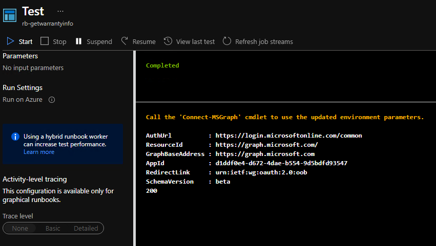
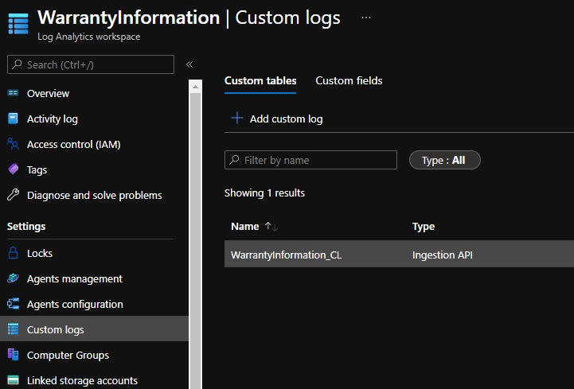
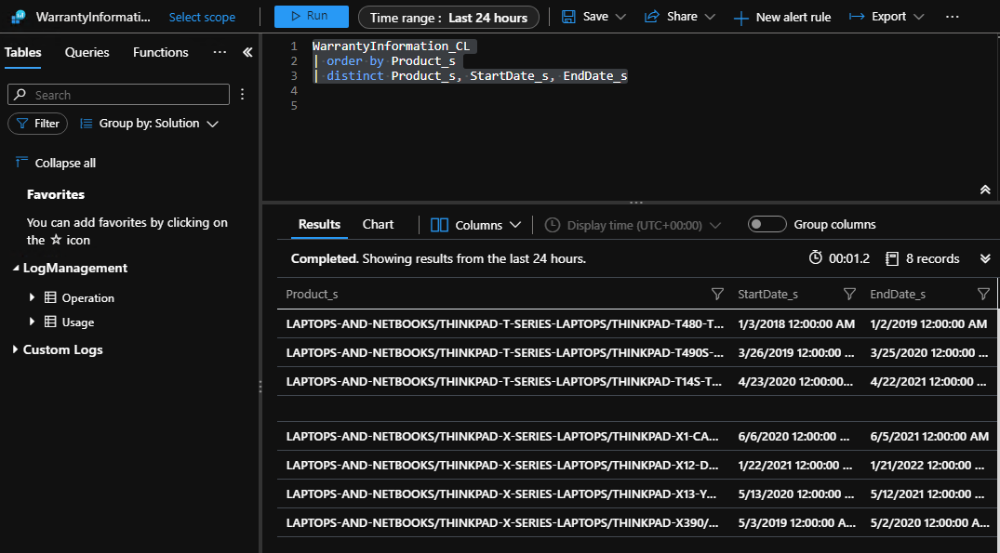
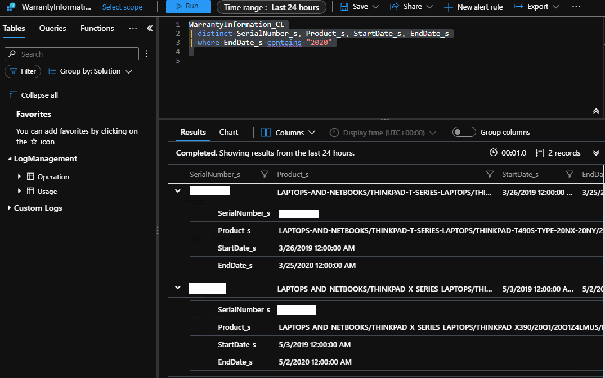

### Collecting and Storing Lenovo Warranty Information to Azure Monitor


*Author: Philip Jorgensen*

A feature add (by popular demand) in Commercial Vantage is the ability to write the device's warranty information to WMI.  

The **Lenovo_WarrantyInformation** WMI class located under the **root\Lenovo** Namespace is created when the **Write Warranty Information to WMI** policy has been enabled on the device.

In this post, we're going to walk through how this data can be collected from Intune managed devices and ingested into a Log Analytics Workspace in Azure Monitor.

The solution is derived from an excellent Microsoft blog [post](https://techcommunity.microsoft.com/t5/device-management-in-microsoft/how-to-collect-custom-inventory-from-azure-ad-joined-devices/ba-p/2280850#.YIGt2nOrV50.linkedin), which provides an example of collecting BIOS information.  Admittedly, I haven't explored the depths of Graph and was surprised to read that script outputs are stored in a **resultMessage** property on the service side, as noted in the post.  

Once I got the grasp of the workflow, I thought why not try and go after warranty information?  Stepping outside of my comfort zone, I decided to take this a bit further by delving into Log Analytics and Azure Automation to automate the collection of this data using a scheduled Runbook.  Fortunately, the MS docs have been incredibly helpful during my testing.

Before you begin, make sure your test devices have the [latest version](https://support.lenovo.com/us/en/solutions/hf003321-lenovo-vantage-for-enterprise) of Commercial Vantage installed and the GPO to write warranty information to WMI has been configured.  Refer to this blog [post](https://thinkdeploy.blogspot.com/2020/11/manage-commercial-vantage-with-intune.html) on how to deploy the setting with Intune or you can configure it manually using the provided .Admx template loaded into the local Group Policy Editor.  You can verify data has been written to WMI by browsing to the namespace using WMIExplorer.

Deploy this PowerShell script to a user/device group to get started

```
Get-CimInstance -Namespace root/Lenovo -ClassName Lenovo_WarrantyInformation | Select-Object `
    SerialNumber, `
    Product, `
    StartDate, `
    EndDate, `
    LastUpdateTime | ConvertTo-Json
```

Once you're starting to see script execution has succeeded on your devices in the MEM [admin center](https://endpoint.microsoft.com/#blade/Microsoft_Intune_DeviceSettings/DevicesWindowsMenu/powershell), access the data via Graph as demonstrated in the blog post referenced earlier.

Here's an example of what you should expect to see in [Graph Explorer](https://developer.microsoft.com/en-us/graph/graph-explorer).


Now that we have data, we're going to send this to the Azure Monitor [HTTP Data Collector API](https://docs.microsoft.com/en-au/azure/azure-monitor/logs/data-collector-api) using PowerShell.  You'll need to note the Workspace ID and Primary Key of the Log Analytics workspace you intend on using.

You can find this information under **Log Analytics workspace > Agents management**


Next, we're going to setup a [PowerShell Runbook](https://docs.microsoft.com/en-us/azure/automation/automation-runbook-types#powershell-runbooks) that will create a POST request to the HTTP Data Collector API that includes our list of devices to send.

Prereqs: 
Azure Automation account.  If you haven't created one, refer to the [MS doc](https://docs.microsoft.com/en-us/azure/automation/automation-quickstart-create-account) on how to do this.
Intune PowerShell SDK, which provides support for the Intune API through Graph.  This module will need to be [imported](https://docs.microsoft.com/en-us/azure/automation/shared-resources/modules#import-modules) from the PowerShell Gallery into Azure Automation before proceeding.  Here's a short script to do so:

```
$ResourceGroup = '<your resource group>'
$AutomationAccount = '<your automation account>'

# URL to Graph package: https://www.powershellgallery.com/packages/Microsoft.Graph.Intune
if (!(Get-AzAutomationModule -ResourceGroupName $ResourceGroup -AutomationAccountName $AutomationAccount | Where-Object { $_.Name -eq $ModuleName -and $_.ProvisioningState -eq 'Succeeded' })) {
    New-AzAutomationModule -Name $ModuleName -ResourceGroupName $ResourceGroup -AutomationAccountName $AutomationAccount -ContentLinkUri 'https://www.powershellgallery.com/api/v2/package/Microsoft.Graph.Intune/6.1907.1.0'
}
```
Verify the module's status shows **Available**


Two Azure Automation string type variables that will hold an Azure user account/encrypted password to authenticate to Graph (make sure this account has the appropriate permissions).  These will be called using the [Get-AutomationVariable](https://docs.microsoft.com/en-us/azure/automation/shared-resources/variables?tabs=azure-powershell#internal-cmdlets-to-access-variables) internal cmdlets.


Once everything is ready to go, choose the Azure Automation account you want to use and click **Runbooks** and **Create a runbook**.  Enter a name and choose **PowerShell** for the runbook type.

I've adjusted the [PowerShell sample](https://docs.microsoft.com/en-au/azure/azure-monitor/logs/data-collector-api#sample-requests) to include the JSON data that will be ingested to the Log Analytics Workspace.  You'll need to replace the **$CustomerId** and **$SharedKey** variables with your Workspace ID and Primary Key.  I've also set the **$LogType** variable to **WarrantyInformation** as this will be the name of the Custom Log that's created to store exactly what we're collecting, warranty information.

Copy/paste the below script to your runbook

```
<#
Set internal automation cmdlets for Graph authentication
Reference: https://docs.microsoft.com/en-us/azure/automation/shared-resources/variables?tabs=azure-powershell#internal-cmdlets-to-access-variables
#>
$AdminUser = Get-AutomationVariable -Name 'AdminUser'
$AdminPassword = Get-AutomationVariable -Name 'AdminPassword'
$SecureAdminPassword = ConvertTo-SecureString -String $AdminPassword -AsPlainText -Force
$Cred = New-Object System.Management.Automation.PSCredential ($AdminUser, $SecureAdminPassword)

# Connect to Graph Beta API
Update-MSGraphEnvironment -SchemaVersion 'beta'
Connect-MSGraph -PSCredential $Cred | Out-Null

<# 
Gather warranty info from successful script executions
Reference: https://techcommunity.microsoft.com/t5/device-management-in-microsoft/how-to-collect-custom-inventory-from-azure-ad-joined-devices/ba-p/2280850#.YIGt2nOrV50.linkedin
#>
$result = Invoke-MSGraphRequest -HttpMethod GET -Url 'deviceManagement/deviceManagementScripts/<script id>/deviceRunStates?$expand=managedDevice' | Get-MSGraphAllPages
$success = $result | Where-Object -Property errorCode -EQ 0
$resultMessage = $success.resultMessage 
$Devices = $resultMessage | ConvertFrom-Json
$newjson = $Devices | ConvertTo-Json

<#
Below sample request reference:
https://docs.microsoft.com/en-au/azure/azure-monitor/logs/data-collector-api?WT.mc_id=EM-MVP-5002871&ranMID=24542&ranEAID=je6NUbpObpQ&ranSiteID=je6NUbpObpQ-Kk7A3ox8I8XgrRn0d4uDfA&epi=je6NUbpObpQ-Kk7A3ox8I8XgrRn0d4uDfA&irgwc=1&OCID=AID2000142_aff_7593_1243925&tduid=(ir__nxnprvrvwwkfq3kekk0sohzncu2xuln0dh1bwc9k00)(7593)(1243925)(je6NUbpObpQ-Kk7A3ox8I8XgrRn0d4uDfA)()&irclickid=_nxnprvrvwwkfq3kekk0sohzncu2xuln0dh1bwc9k00#sample-requests
#>

# Replace with your Workspace ID
$CustomerId = "xxxxxxxx-xxxx-xxxx-xxxx-xxxxxxxxxxxx"  

# Replace with your Primary Key
$SharedKey = "xxxxxxxxxxxxxxxxxxxxxxxxxxxxxx"

# Specify the name of the record type that you'll be creating
$LogType = "WarrantyInformation"

# You can use an optional field to specify the timestamp from the data. If the time field is not specified, Azure Monitor assumes the time is the message ingestion time
$TimeStampField = ""

# Create the function to create the authorization signature
Function Build-Signature ($customerId, $sharedKey, $date, $contentLength, $method, $contentType, $resource)
{
    $xHeaders = "x-ms-date:" + $date
    $stringToHash = $method + "`n" + $contentLength + "`n" + $contentType + "`n" + $xHeaders + "`n" + $resource

    $bytesToHash = [Text.Encoding]::UTF8.GetBytes($stringToHash)
    $keyBytes = [Convert]::FromBase64String($sharedKey)

    $sha256 = New-Object System.Security.Cryptography.HMACSHA256
    $sha256.Key = $keyBytes
    $calculatedHash = $sha256.ComputeHash($bytesToHash)
    $encodedHash = [Convert]::ToBase64String($calculatedHash)
    $authorization = 'SharedKey {0}:{1}' -f $customerId,$encodedHash
    return $authorization
}


# Create the function to create and post the request
Function Post-LogAnalyticsData($customerId, $sharedKey, $body, $logType)
{
    $method = "POST"
    $contentType = "application/json"
    $resource = "/api/logs"
    $rfc1123date = [DateTime]::UtcNow.ToString("r")
    $contentLength = $body.Length
    $signature = Build-Signature `
        -customerId $customerId `
        -sharedKey $sharedKey `
        -date $rfc1123date `
        -contentLength $contentLength `
        -method $method `
        -contentType $contentType `
        -resource $resource
    $uri = "https://" + $customerId + ".ods.opinsights.azure.com" + $resource + "?api-version=2016-04-01"

    $headers = @{
        "Authorization" = $signature;
        "Log-Type" = $logType;
        "x-ms-date" = $rfc1123date;
        "time-generated-field" = $TimeStampField;
    }

    $response = Invoke-WebRequest -Uri $uri -Method $method -ContentType $contentType -Headers $headers -Body $body -UseBasicParsing
    return $response.StatusCode

}

# Submit the data to the API endpoint
Post-LogAnalyticsData -customerId $customerId -sharedKey $sharedKey -body ([System.Text.Encoding]::UTF8.GetBytes($newjson)) -logType $logType
```

Click on **Test pane** and click on **Start**.  After a few seconds, you should see **Complete**



Let's check out the new Custom Log in our [workspace](https://portal.azure.com/#blade/Microsoft_Azure_Monitoring/AzureMonitoringBrowseBlade/lawsInsights).  Click the **Custom logs** blade.  There should now be a **WarrantyInformation_CL** visible.  Notice the type is **Ingestion API**.  



Head over to the [Azure Monitor Logs](https://portal.azure.com/#blade/Microsoft_Azure_Monitoring/AzureMonitoringBrowseBlade/logs) and run the following query to see our devices.

```
WarrantyInformation_CL
| order by Product_s
| distinct Product_s, StartDate_s, EndDate_s
```


Yay!  Warranty data!

If you don't need to make any further changes with the Runbook, click on **Publish**.  

Another example would be if you wanted to only show devices whose Warranty ended in the year 2020, you could run this query

```
WarrantyInformation_CL
| distinct SerialNumber_s, Product_s, StartDate_s, EndDate_s
| where EndDate_s contains "2020"
```


You can also pin a specific query to your dashboard if you desire


Now we can set up a recurring [schedule](https://docs.microsoft.com/en-us/azure/automation/shared-resources/schedules#create-a-schedule) for the Runbook to monitor our fleet's warranty.