### ThinkShield secure wipe using Microsoft Endpoint Manager


*Author: Philip Jorgensen*

**OVERVIEW**

ThinkShield secure wipe is the successor to the ThinkPad Drive Erase Utility and is designed to provide the wipe out function of the SSD.

Although the Drive Erase Utility is still supported and provided as an external tool, ThinkShield secure wipe is fully integrated in the BIOS image and does not require any external tools.

Secure wipe can be executed locally by BIOS from the application menu of the Startup Boot Menu invoked by [F12] or remotely from OS through the WMI interface, which is what this post will be covering. 

*Supported Systems*

- All Comet Lake (2020) ThinkPad
- ThinkCentre (Awaiting Confirmation)
- ThinkStation (Awaiting Confirmation)

?>DISCLAIMER: These examples are intended to demonstrate a few different methods available to deploy the solution and not necessarily a "Best Practice".  Adjust accordingly to fit your environment's needs.  There is also no auditing/reporting provided by these methods.

**REQUIREMENTS**

The WMI service for ThinkShield secure wipe is available only when one of the following is set

- Supervisor Password (SVP)
- System Management Password (SMP)
- Hard Disk Password (HDP)

Sample PowerShell script that executes secure wipe on target system.

https://github.com/CDRT/Library/tree/master/secure-wipe

Save as **Invoke-ThinkShieldSecureWipe.ps1**

--

**EXAMPLE SCENARIO 1a** - Deploy from MEMCM using Run Scripts

Navigate to Software Library > Scripts > Create Script and either import Invoke-ThinkShieldSecureWipe.ps1 or copy the contents into the script editor field

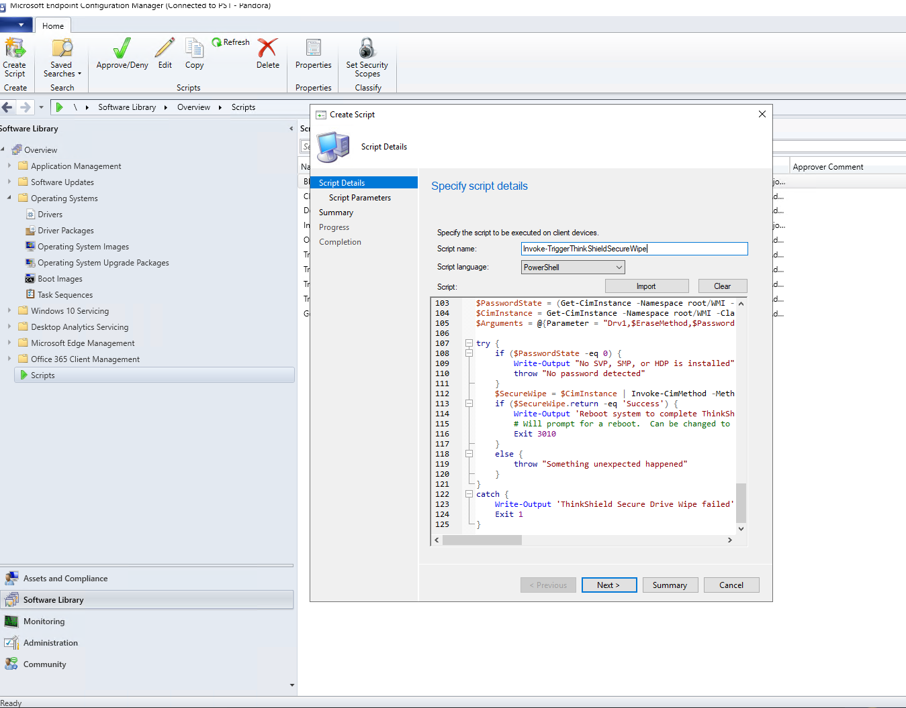

Specify the **EraseMethod**, **PasswordType**, and **Password** parameters.  Details for each parameter is explained in the script header.

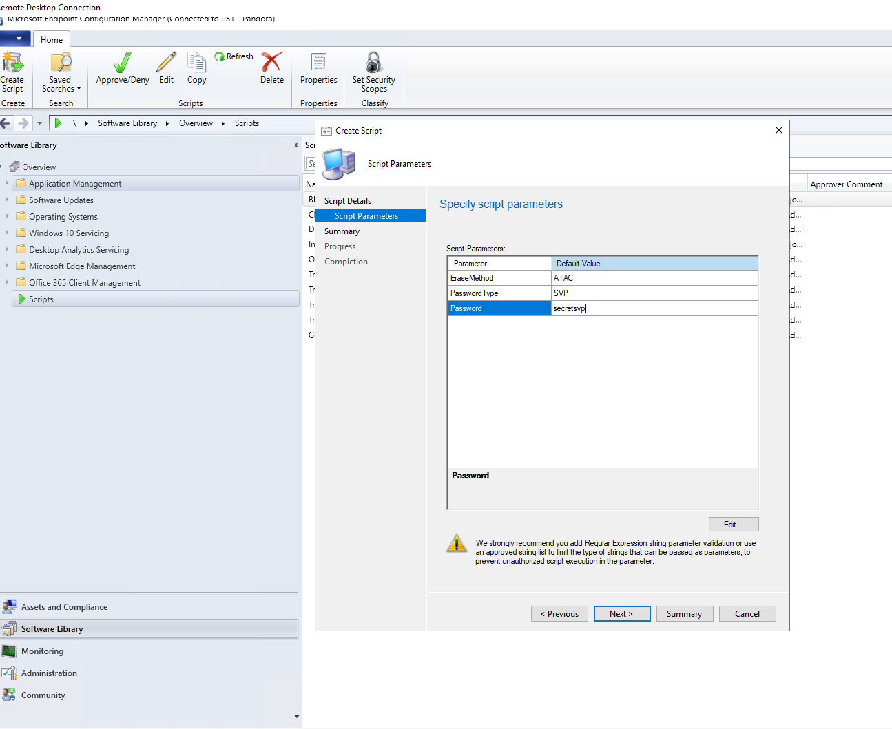

Complete the **Create Script** wizard and Approve it

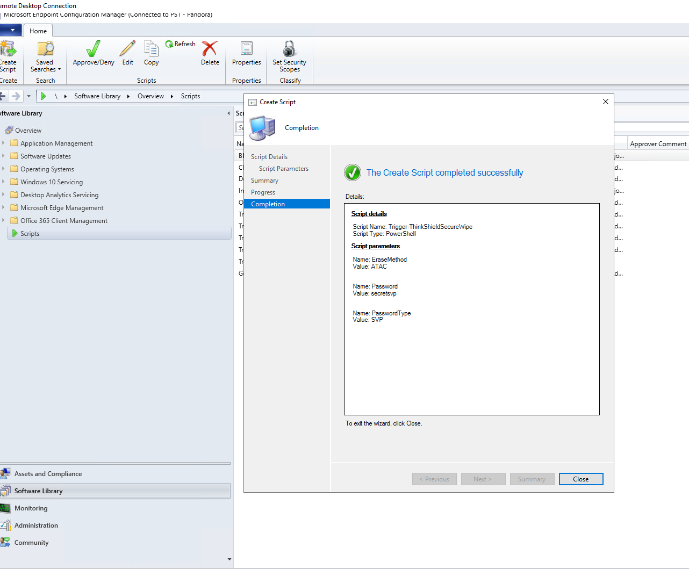

Deploy to a single system or collection of systems.  If successful, you should see a message stating the secure wipe succeeded and that the system needs to reboot to finish.

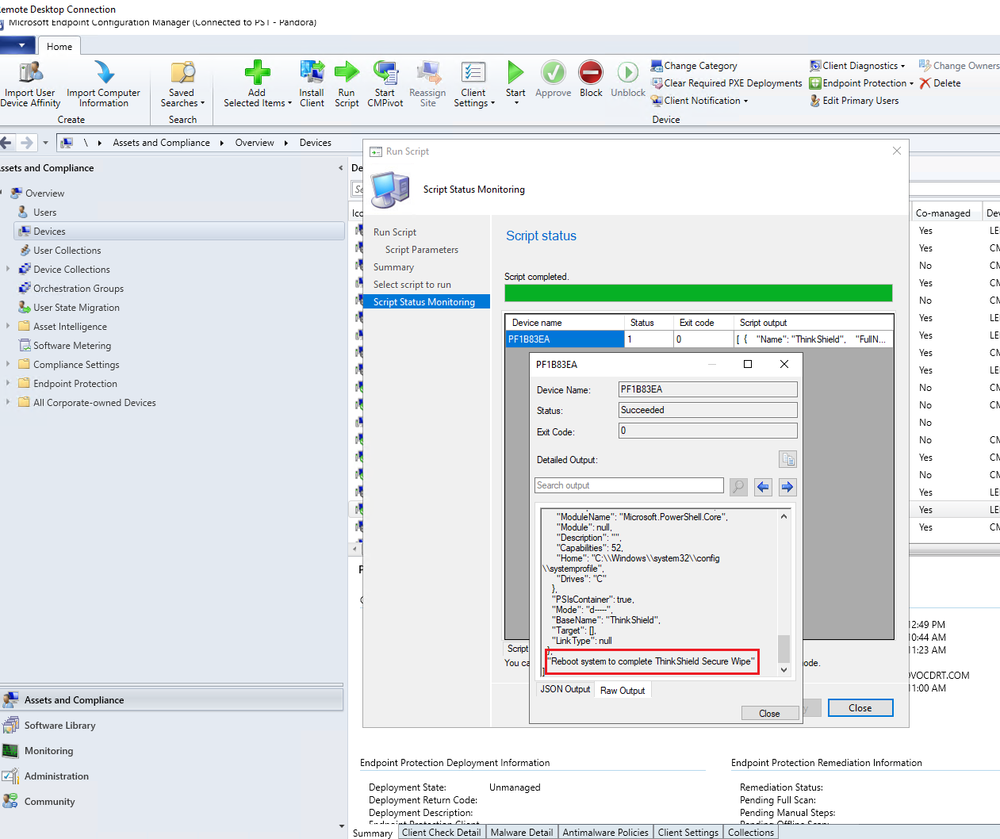

**EXAMPLE SCENARIO 1b** - Deploy from MEMCM as a Task Sequence

Create a new **Custom Task Sequence**.  Edit the Task Sequence and add a **Run PowerShell Script** step.  Tick the radio button **Enter a PowerShell script** and click **Edit Script...**

Browse to **Invoke-ThinkShieldSecureWipe.ps1** or copy the contents into the script editor.

In the **Parameters** field, enter the required parameters.

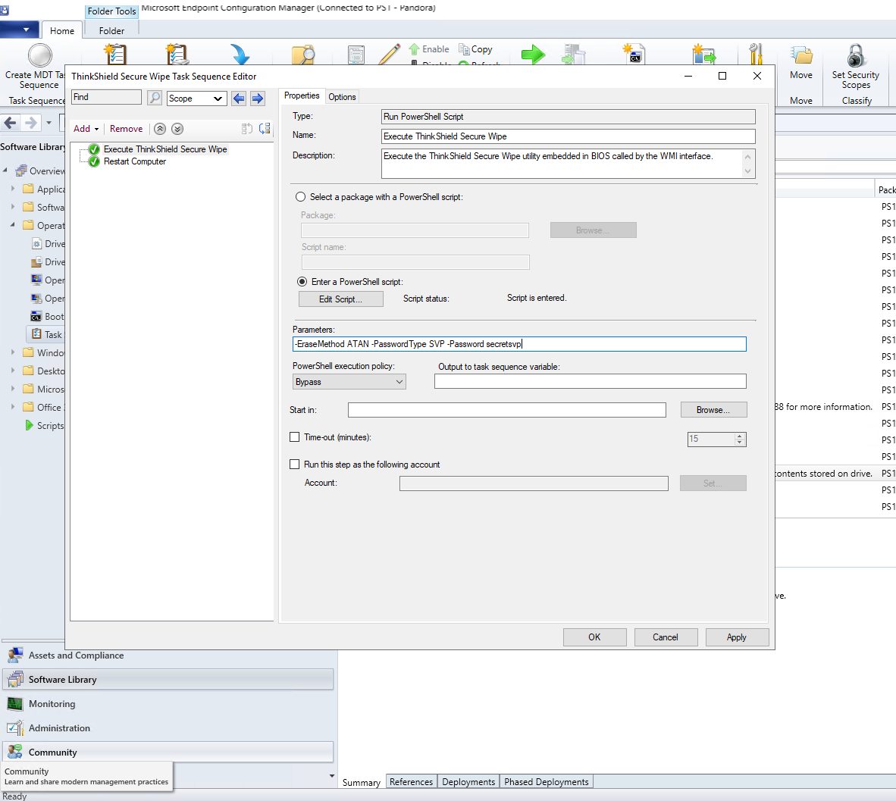

Add a **Restart Computer** step to transition the system to secure wipe.  In my lab, I deployed as an available Task Sequence and customized the notification texts.

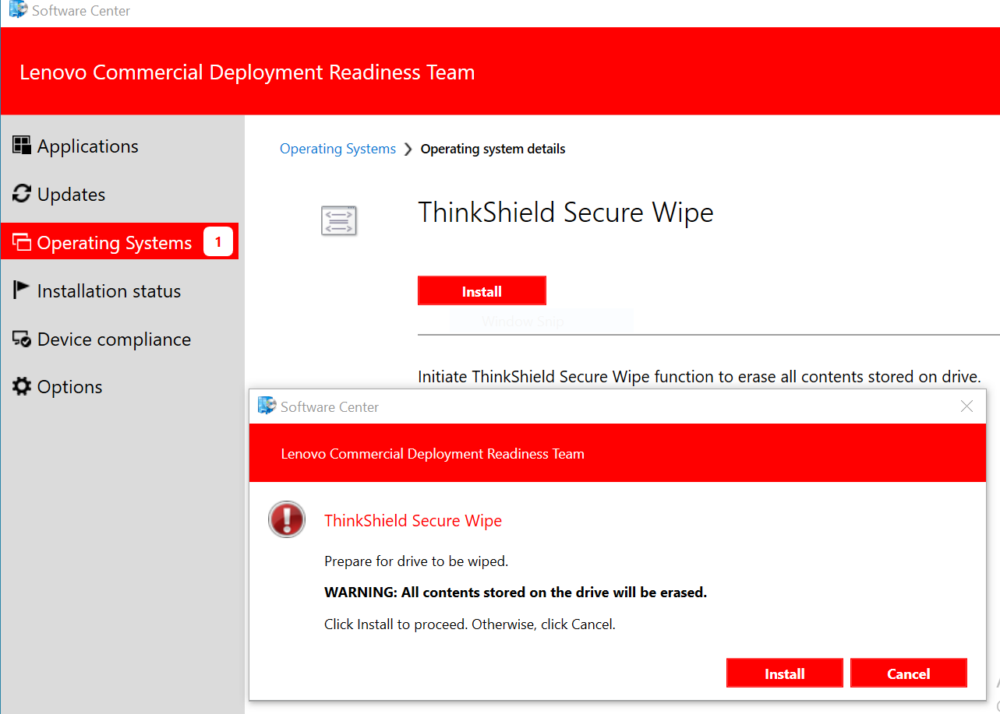

**EXAMPLE SCENARIO 2** - Deploy from Intune

Package the **Invoke-ThinkShieldSecureWipe.ps1** as a Win32 app using the Microsoft Win32 Content Prep Tool.

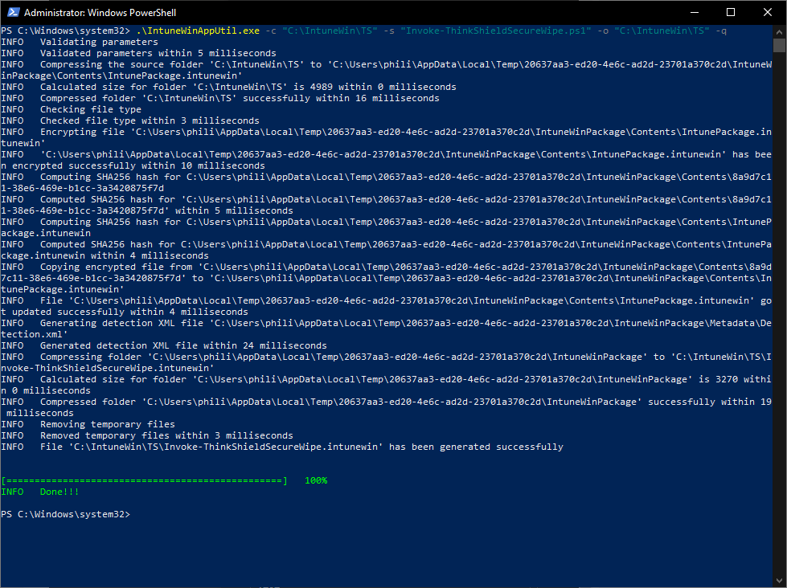

Log into the MEM [admin center](https://endpoint.microsoft.com/#blade/Microsoft_Intune_DeviceSettings/AppsWindowsMenu/windowsApps) and add a new **Win32 app**.  Browse to the **Invoke-ThinkShieldSecureWipe.intunewin** file and add it for upload.

Specify App Information such as a **Name**, **Description**, and **Publisher**

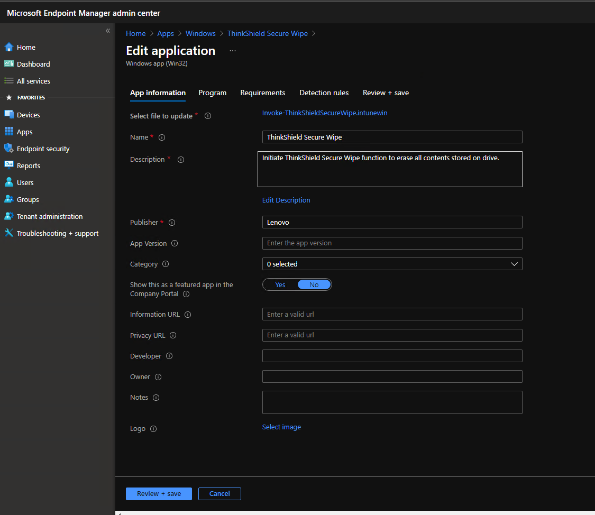

Specify Program details

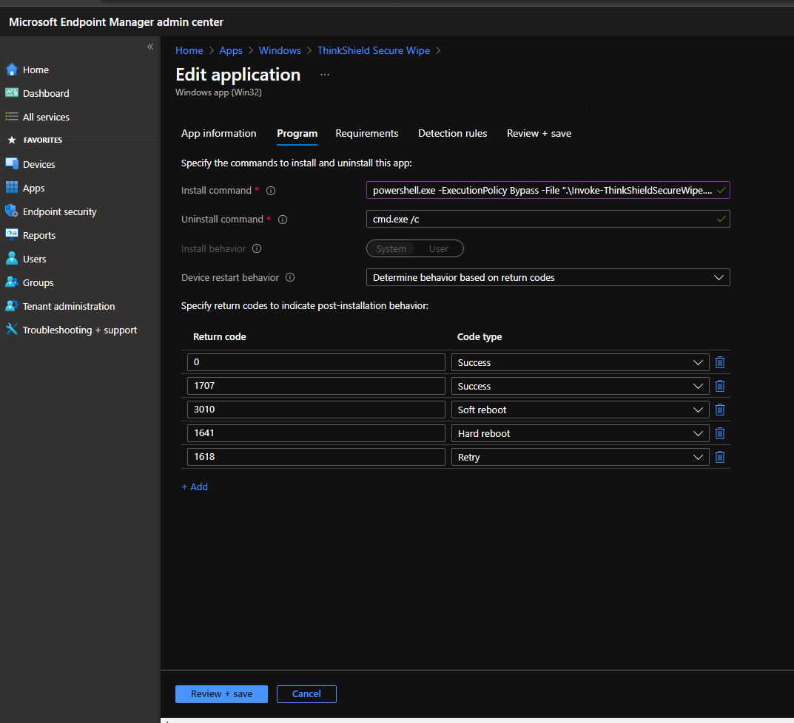

**Install Command**
```
powershell.exe -ExecutionPolicy Bypass -File ".\Trigger-ThinkShieldSecureWipe.ps1" -EraseMethod ATAN -PasswordType SVP -Password secretsvp
```

**Uninstall Command**
```
cmd.exe /c
```
**Device Restart Behavior**: Determine based on return codes

Set the OS architecture to **64-bit** and Minimum OS to **Windows 10 1607**

Add an additional requirement rule to check the system is in fact a Lenovo system.

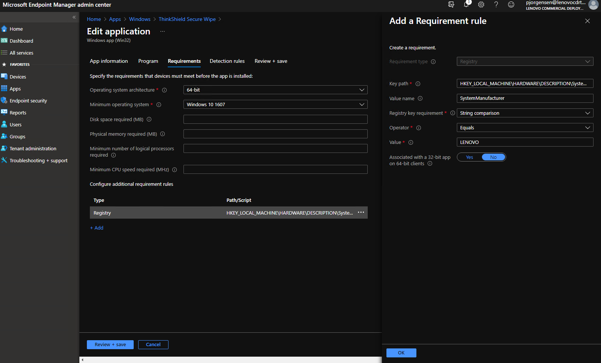

- **Registry Type**
    - **Key Path**: HKEY_LOCAL_MACHINE\HARDWARE\DESCRIPTION\System\BIOS
    - **Value Name**: SystemManufacturer
    - **Key Requirement**: String Comparison
    - **Operator**: Equals
    - **Value**: LENOVO

Set the detection rule to check the presence of a **File**

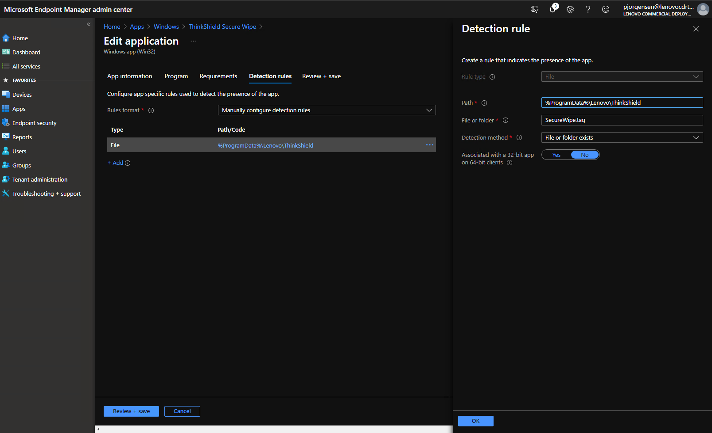

This file will be created automatically when the script is run.
- **Path**: %ProgramData%\Lenovo\ThinkShield
- **File or folder**: SecureWipe.tag
- **Detection method**: File or folder exists

Deploy the app to a group.  In my testing, I deployed as available and installed through the Company Portal.  After a successful install, a toast notification is presented instructing for the reboot.

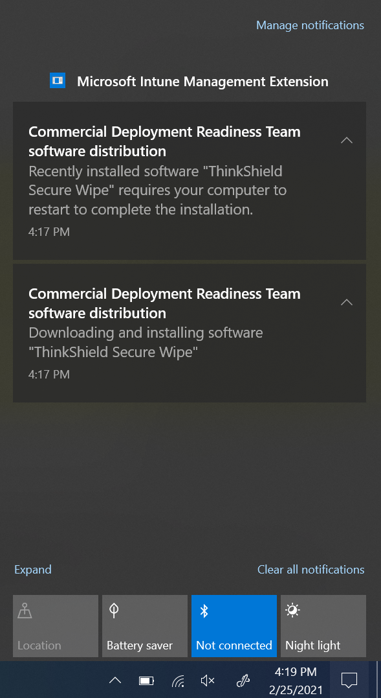

Once a system has restarted, the final result will look like this.  The system will automatically shut down.

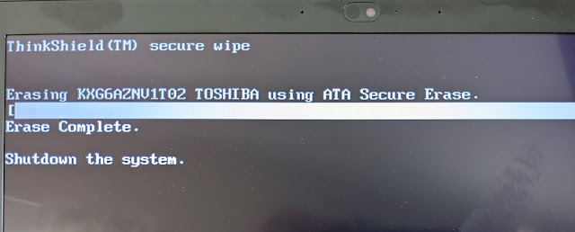