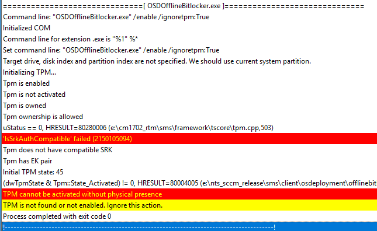

# Preparing the TPM for BitLocker Pre-provisioning using ConfigMgr


---

Pre-provisioning the disk will encrypt only used space, so when this step executes, the drive will be encrypted before the operating system has been laid down to the client, saving a ton of time.

The catch here is that in order for pre-provisioning to work, a TPM has to be present on the system AND enabled, as stated in the Pre-provision BitLocker step.


All Lenovo ThinkPads with Discrete TPM 1.2 are shipped from the factory with the TPM enabled but **NOT** Active. Systems with TPM 2.0 only should already be Enabled. If the system runs through a deployment without activating the TPM in BIOS, pre-provisioning will not work. If you review the **OSDOfflineBitlocker.exe** section of the **smsts.log**, you'll see the failure



In a few simple steps, here's how to activate the TPM on newly shipped systems with Discrete TPM 1.2:

- In your Task Sequence, add a new Group named **Configure Security Chip** after the disk partition step.

- Add a Run Command Line step with the following command line:

```cmd
powershell.exe -Executionpolicy Bypass -Command "(Get-WmiObject -Namespace "root\CIMV2\Security\MicrosoftTpm" -Class Win32_TPM).SetPhysicalPresenceRequest(10)"
```

?> This will enable, activate, and allow the installation of a TPM owner.  (More information on the SetPhysicalPresenceRequest method can be found [**here**](https://msdn.microsoft.com/en-us/library/aa376478(v=vs.85).aspx).)

- Add a **Restart Computer** step, booting to the boot image assigned to the Task Sequence.

- Confirm the **Enable BitLocker** step is near or at the end of the Task Sequence.

That's all! You will notice the computer restart twice for the settings to be applied. Once the deployment finishes, verify BitLocker is in fact on.


For more control over the **Configure Security Chip** group, you can add conditions that determines whether or not the group executes. For example, if the Security Chip is already Active and Enabled, it's not really necessary to go through these steps every time.

## Recommended

In the **Configure Security Chip** group, add an **If any** condition with the following two conditions:

- **WMI Namespace**: root\cimv2\Security\MicrosoftTpm
  - **WQL Query**: SELECT * FROM Win32_Tpm WHERE IsEnabled_InitialValue = False

- **WMI Namespace**: root\cimv2\Security\MicrosoftTpm
  - **WQL Query**: SELECT * FROM Win32_Tpm WHERE IsActivated_InitialValue = False

## Not recommended but can work

In the **Configure Security Chip** group, add an **If none** condition with the following condition:

- **WMI Namespace**: root\wmi
  - **WQL Query**: SELECT * FROM Lenovo_BiosSetting WHERE CurrentSetting = 'SecurityChip,Active'

Now, when you deploy systems that may already have the Security Chip activated, it will skip this group and continue on.

### Notes

One thing to be aware of is that the value set in WMI for the Security Chip may vary. You can confirm by running this command in PowerShell on your system:

```powershell
(Get-WmiObject -Namespace "root\wmi" -Class Lenovo_BiosSetting).CurrentSetting
```

Look for Security Chip and note the value, like below:


You may encounter on some systems the value is slightly different, i.e. **Security Chip,Active** or **SecurityChip,Enable** or **Security Chip,Enabled**

If that's the case, just add another WMI Query to the **Configure Security Chip** group so it catches all values.

?> Systems that have TPM 2.0 only equipped should be enabled by default from the factory. If it's disabled, the below commands can be used to enable it:

```cmd
powershell.exe -Executionpolicy Bypass -Command "(gwmi –NameSpace root\wmi –Class Lenovo_SetBIOSSetting).SetBIOSSetting(“SecurityChip,Enable”)"
```

```cmd
powershell.exe -Executionpolicy Bypass -Command "(gwmi –NameSpace root\wmi –Class Lenovo_SaveBIOSSettings).SaveBIOSSettings()"
```

Reboot the system and the TPM should now be enabled.
