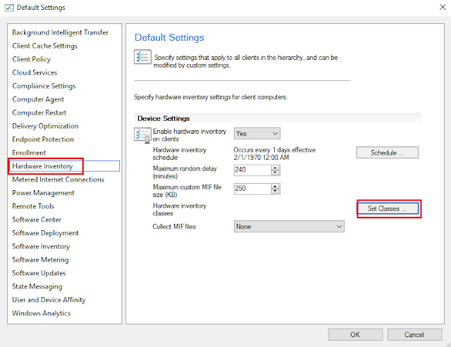
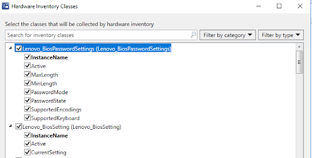

# Reporting BIOS Password States on <br> Think Products with ConfigMgr

?> Updated: 2019-09

---

There may be a need to run a report on your Think products to check which BIOS settings are enabled or disabled, or if there is even a BIOS supervisor password set.

This post will walk through creating a simple custom report in ConfigMgr that will display the following:

- All Lenovo Think products
- Model (Friendly Names)
- Computer Name
- BIOS Version
- Is TPM Enabled?
- Is TPM Activated?
- Secure Boot Status
- UEFI Enabled?
- Device Guard in BIOS Enabled?
- BIOS Password(s) Set

---

**[Extending Hardware Inventory](https://docs.microsoft.com/en-us/sccm/core/clients/manage/inventory/extend-hardware-inventory)**

First, you'll need to extend hardware inventory.  To make this a bit easier, there's a zip at the bottom of the page you can download that contains a MOF file you can import into your Default Client Settings that will add these classes

- Lenovo_BiosSetting
- Lenovo_Bios PasswordSettings

Open the Default Client Settings, select Hardware Inventory, and click Set Classes



On the Hardware Inventory Class window, click Import.  Select the MOF file containing the Lenovo WMI Classes.  Leave the default radio button selected to import both the inventory classes and settings and Click Import.  Click Ok to complete.




Once the clients receive the updated Client Settings, the two Lenovo classes will be inventoried and can be reviewed in Resource Explorer.  If you have a mixed environment of different vendors, it may be a good idea to create Custom Client Settings and deploy only to a Collection containing Lenovo hardware.

**Creating a [Custom Report](https://docs.microsoft.com/en-us/sccm/core/servers/manage/creating-custom-report-models-in-sql-server-reporting-services)**

Also at the bottom of the page is a sample report you can import into your SSRS.  Assuming you have the Reporting Services Point role installed and configured, find the URL of your Report Manager.  This can be found in the Console under the **Monitoring Workspace / Reporting Node**


Open Internet Explorer, navigate to the Report Manager URL and choose a path to upload the report to.  Once uploaded, edit the report in Report Builder.  You'll need to replace the Data Source and make any other customizations to fit your environment.  Here's an example of what will be presented


You'll notice in the example, different values under the BIOS Password(s) column.  These correspond to the integer that's displayed in the Password State property when querying the Lenovo_BiosPasswordSettings class.  There were 8 new values introduced in the Whisky Lake generation of ThinkPad.  Complete list below:

**0**   |   No BIOS Password Set

**1**   |   Only Power On Password

**2**   |   Only Supervisor Password

**3**   |   User HDD and/or User HDD and Master Password

**5**   |	Power On + User HDD and/or User HDD and Master Password

**6**   |	Supervisor + User HDD and/or User HDD and Master Password

**7**   |	Supervisor + Power On + User HDD and/or User HDD and Master Password

**64**  |	Only System Management Password

**65**  |	System Management + Power On Password

**66**  |	Supervisor + System Management Password

**67**  |	Supervisor + System Management + Power On Password

**68**  |	System Management + User HDD and/or User HDD Master Password

**69**  |	System Management + Power On + User HDD and/or User HDD Master Password

**70**  |	Supervisor + System Management + User HDD and/or User HDD Master Password

**71**  |	Supervisor + System Management + Power On + User HDD and/or User HDD Master Password

I'm by no means a SQL expert but below is the query used to pull this data

```sql
SELECT DISTINCT
  SMS_G_System_COMPUTER_SYSTEM.Manufacturer00 AS 'Manufacturer',
  __em_COMPUTER_SYSTEM_PRODUCT0.Version00 AS 'Model',
  SMS_G_System_COMPUTER_SYSTEM.Name00 AS 'Computer Name',
  SMS_G_System_PC_BIOS.SMBIOSBIOSVersion00 AS 'BIOS Version',
  CASE
    WHEN SMS_G_System_TPM.IsEnabled_InitialValue00 = 1 THEN 'Yes'
    ELSE 'No'
  END AS 'TPM Enabled',
  CASE
    WHEN SMS_G_System_TPM.IsActivated_InitialValue00 = 1 THEN 'Yes'
    ELSE 'No'
  END AS 'TPM Activated',
  CASE
    WHEN SMS_G_System_FIRMWARE.SecureBoot00 = 1 THEN 'Enabled'
    ELSE 'Disabled'
  END AS 'Secure Boot',
  CASE
    WHEN SMS_G_System_FIRMWARE.UEFI00 = 1 THEN 'Enabled'
    ELSE 'Disabled'
  END AS 'UEFI',
  CASE
    WHEN ___System_LENOVO_BIOSSETTING2.CurrentSetting00 LIKE 'Device Guard,Enabled%' THEN 'Enabled'
    WHEN ___System_LENOVO_BIOSSETTING2.CurrentSetting00 LIKE 'DeviceGuard,Enable%' THEN 'Enabled'
    ELSE 'Disabled'
  END AS 'Device Guard',
  CASE
    WHEN __ENOVO_BIOSPASSWORDSETTINGS1.PasswordState00 = 1 THEN 'Only Power On Password'
    WHEN __ENOVO_BIOSPASSWORDSETTINGS1.PasswordState00 = 2 THEN 'Only Supervisor Password'
    WHEN __ENOVO_BIOSPASSWORDSETTINGS1.PasswordState00 = 3 THEN 'Supervisor + Power On Password'
    WHEN __ENOVO_BIOSPASSWORDSETTINGS1.PasswordState00 = 4 THEN 'User HDD and/or User HDD and Master Password'
    WHEN __ENOVO_BIOSPASSWORDSETTINGS1.PasswordState00 = 5 THEN 'Power On + User HDD and/or User HDD and Master Password'
    WHEN __ENOVO_BIOSPASSWORDSETTINGS1.PasswordState00 = 6 THEN 'Supervisor + User HDD and/or User HDD and Master Password'
    WHEN __ENOVO_BIOSPASSWORDSETTINGS1.PasswordState00 = 7 THEN 'Supervisor + Power On + User HDD and/or User HDD and Master Password'
    WHEN __ENOVO_BIOSPASSWORDSETTINGS1.PasswordState00 = 64 THEN 'Only System Management Password'
 WHEN __ENOVO_BIOSPASSWORDSETTINGS1.PasswordState00 = 65 THEN 'System Management + Power On Password'
    WHEN __ENOVO_BIOSPASSWORDSETTINGS1.PasswordState00 = 66 THEN 'Supervisor + System Management Password'
 WHEN __ENOVO_BIOSPASSWORDSETTINGS1.PasswordState00 = 67 THEN 'Supervisor + System Management + Power On Password'
 WHEN __ENOVO_BIOSPASSWORDSETTINGS1.PasswordState00 = 68 THEN 'System Management + User HDD and/or User HDD Master Password'
 WHEN __ENOVO_BIOSPASSWORDSETTINGS1.PasswordState00 = 69 THEN 'System Management + Power On + User HDD and/or User HDD Master Password'
 WHEN __ENOVO_BIOSPASSWORDSETTINGS1.PasswordState00 = 70 THEN 'Supervisor + System Management + User HDD and/or User HDD Master Password'
 WHEN __ENOVO_BIOSPASSWORDSETTINGS1.PasswordState00 = 71 THEN 'Supervisor + System Management + Power On + User HDD and/or User HDD Master Password'
    ELSE 'No BIOS Passwords Set'
  END AS 'BIOS Password(s)'
FROM vSMS_R_System AS SMS_R_System
INNER JOIN COMPUTER_SYSTEM_PRODUCT_DATA AS __em_COMPUTER_SYSTEM_PRODUCT0
  ON __em_COMPUTER_SYSTEM_PRODUCT0.MachineID = SMS_R_System.ItemKey
INNER JOIN Computer_System_DATA AS SMS_G_System_COMPUTER_SYSTEM
  ON SMS_G_System_COMPUTER_SYSTEM.MachineID = SMS_R_System.ItemKey
INNER JOIN TPM_DATA AS SMS_G_System_TPM
  ON SMS_G_System_TPM.MachineID = SMS_R_System.ItemKey
INNER JOIN Firmware_DATA AS SMS_G_System_FIRMWARE
  ON SMS_G_System_FIRMWARE.MachineID = SMS_R_System.ItemKey
INNER JOIN LENOVO_BIOSPASSWORDSETTINGS_DATA AS __ENOVO_BIOSPASSWORDSETTINGS1
  ON __ENOVO_BIOSPASSWORDSETTINGS1.MachineID = SMS_R_System.ItemKey
INNER JOIN PC_BIOS_DATA AS SMS_G_System_PC_BIOS
  ON SMS_G_System_PC_BIOS.MachineID = SMS_R_System.ItemKey
INNER JOIN LENOVO_BIOSSETTING_DATA AS ___System_LENOVO_BIOSSETTING2
  ON ___System_LENOVO_BIOSSETTING2.MachineID = SMS_R_System.ItemKey
WHERE SMS_G_System_COMPUTER_SYSTEM.Manufacturer00 = N'LENOVO'
AND __em_COMPUTER_SYSTEM_PRODUCT0.Version00 LIKE N'Think%'
/*AND ___System_LENOVO_BIOSSETTING2.CurrentSetting00 LIKE N'Device Guard%'
OR ___System_LENOVO_BIOSSETTING2.CurrentSetting00 LIKE N'DeviceGuard%'*/
```

?>The [Device Guard](https://docs.microsoft.com/en-us/sccm/protect/deploy-use/use-device-guard-with-configuration-manager) BIOS setting is what's being reported only.  You will still need to perform OS side Device Guard configurations.  If a system does not have the Device Guard BIOS setting present, it will be filtered from the report.  You can comment out the last 2 lines of the query if you're certain the systems you're reporting on do have the Device Guard BIOS setting.

**Downloads**

MOF File: https://download.lenovo.com/cdrt/blog/Lenovo-WMIClasses.zip

Sample Report (CDRT logo has been removed): https://download.lenovo.com/cdrt/blog/Lenovo-TPM_BiosPassword_SecureBoot_Status-Report.zip