### How to Use ThinkCentre's TPM Firmware <br> Switch Tool with ConfigMgr
*Author: Philip Jorgensen*

---
This article will cover the TPM Firmware Switch Tool that was released to remedy affected ThinkCentres described in the [LEN-15552 Security Advisory](https://support.lenovo.com/us/en/product_security/len-15552).

| M71x-Series | M91x-Series |
|-------------|-------------|
| M710t | M910t |
| M710s | M910s |
| M710q | M910q |
| M715s | M910x |
| M715t |
 

!>If a system is configured for TPM 2.0, the BIOS level must be at a specific level before the firmware update can be applied. Links to the BIOS versions can be found in the matrix.

To summarize, the tool will update the TPM firmware to the latest version, whether it be TPM Spec 1.2 or 2.0. It will also allow you to switch the TPM Spec version from 1.2 to 2.0 or vice versa if desired, while also applying the latest TPM firmware in the process.

BitLocker (or an alternative) will need to be suspended prior to performing the update otherwise you will be prompted for the Recovery Key after the flash completes and the system reboots. Most importantly, a **Supervisor Password** is required before attempting to update or switch the TPM firmware.

After you've downloaded and extracted the contents of the tool to a source location, you'll want to edit the flash.cmd by removing the shutdown switch that forces the system to reboot. That way, you can call the shutdown at the end of the task sequence with the **SMSTSPostAction** variable.

Look for the following line in the flash.cmd and remove **/shutdown** and save the file.

```cmd
%Flashtool% /CAPFILE:%FWFILE% /pw:%BIOSPWD% /shutdown
```

Create a Package in your ConfigMgr console, no program, pointing to the source location of where you extracted the contents of the zip.

Below is a sample Task Sequence that shows the workflow of how this tool can be used to switch TPM Spec versions while applying the latest firmware:

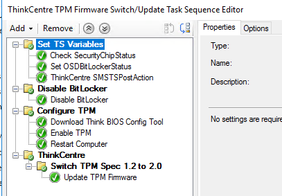

**Group 1-Set TS Variables**

- Check SecurityChipStatus - Task Sequence Variable


WMI Query to check if the Security Chip is Spec 1.2
```wql
SELECT * From Lenovo_BiosSetting WHERE CurrentSetting LIKE 'Security Chip 1.2,Active'
```

?>The value here may differ across models, i.e. **SecurityChip, Active** or **Security Chip,Enable**. Be sure to double check this before adding your query.

- Set OSDBitLockerStatus - Task Sequence Variable (credit to [Mike Terrill](https://miketerrill.net/2017/04/19/how-to-detect-suspend-and-re-enable-bitlocker-during-a-task-sequence/)).


WMI Query to check if the system drive is encrypted and protection is on.
```wql
SELECT * From Win32_EncryptableVolume WHERE DriveLetter = 'C:' and ProtectionsStatus = '1'
```

- ThinkCentre SMSTSPostAction - Task Sequence Variable

?>This will invoke the flash due to the required shutdown. Remember this was removed from **flash.cmd** earlier, otherwise the task sequence would break.

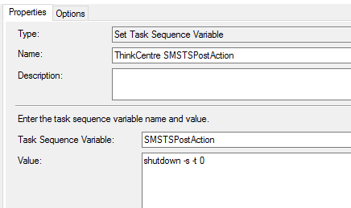

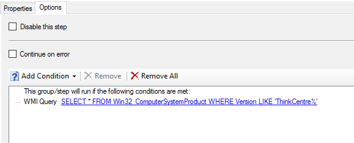

WMI Query to check if the system is a ThinkCentre
```wql
SELECT * FROM Win32_ComputerSystemProduct WHERE Version LIKE 'ThinkCentre%'
```

**Group 2-Disable BitLocker**

- Native Disable BitLocker step

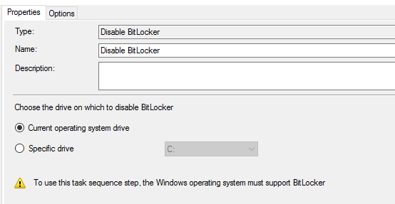

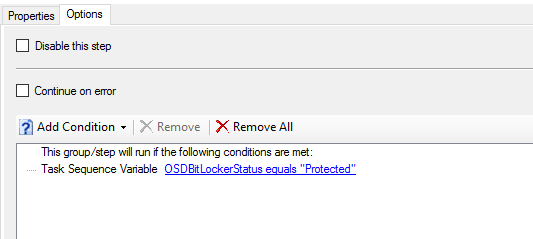

Add a condition to check if Task Sequence Variable **OSDBitLockerStatus** status equals **Protected**.

**Group 3-Configure TPM**

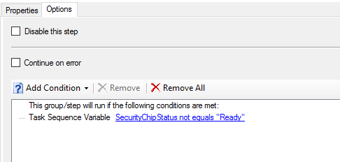

Add a condition to check if Task Sequence Variable **SecurityChipStatus** does not equal **Ready**.

- Download Think BIOS Config Tool - Download Package Content Step
    - I'm using the [BIOS Config Tool](https://docs.lenovocdrt.com/#/tbct/tbct_top) to enable the security chip.

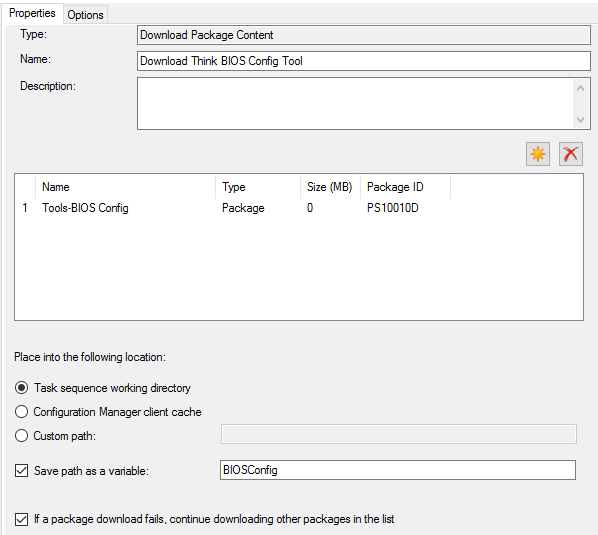


- Run Command Line - Enable TPM

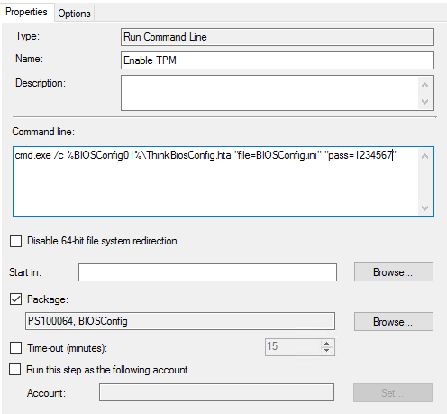
```cmd
cmd.exe /c %BIOSConfig01%\ThinkBiosConfig.hta "file=BIOSConfig.ini" "pass=1234567"
```

By using the BIOS Config Tool, I'm calling the configuration file .ini that holds the value to enable the security chip while passing the Supervisor Password. Alternatively, this can be achieved using Run Command Line steps calling PowerShell and setting/saving the BIOS settings stored in the Lenovo_BiosSetting namespace.

- Restart Computer Step - Back to Operating System


**Group4-ThinkCentre**

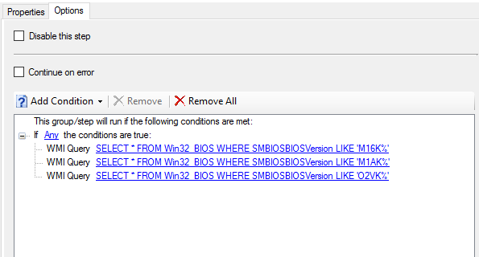

These WMI queries will check the first 4 characters of the BIOS version, which matches to each of the affected ThinkCentres as noted in the security bulletin matrix. Refer to the [Deployment Recipe Card](https://download.lenovo.com/cdrt/ddrc/RecipeCardWeb.html) for these queries.

**Group5-TPM Spec 1.2 to 2.0**

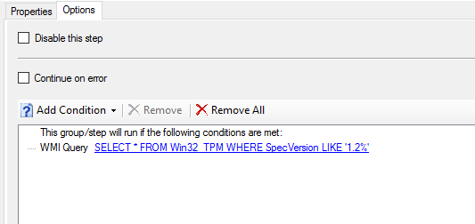

WMI Query to check the TPM Spec is 1.2 before continuing to switch to 2.0.

**Namespace: root\cimv2\Security\MicrosoftTpm**
```wql
SELECT * From Win32_Tpm WHERE SpecVersion LIKE '1.2%'
```

- Run Command Line-Update TPM Firmware

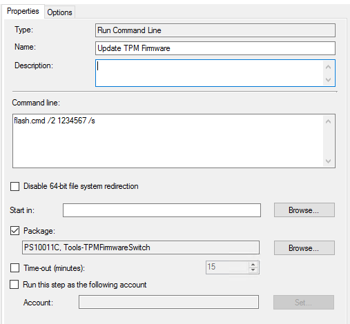

```cmd
flash.cmd /2 1234567 /s
```

---
**Further research, notes and caveats**

- If the Security Chip is Inactive, the TPM will not have an owner. Once the **Configure TPM** group is executed and Security Chip becomes Active, Windows 10 will take ownership of the TPM automatically.  Clearing the TPM will not be necessary after this.
- If down-leveling from TPM 2.0 to 1.2 using the /1 switch, adjust the SpecVersion query to:

```wql
SELECT * FROM Win32_TPM WHERE SpecVersion LIKE '2.0%'
```

- As a result of down-leveling, the TPM will become disabled, inactive, and unowned. This can be fixed using the **SetPhysicalPresenceRequest** [method](https://docs.microsoft.com/en-us/windows/win32/secprov/setphysicalpresencerequest-win32-tpm).  (10-Enable, activate, and allow the installation of a TPM owner.)
- Windows 10 will automatically re-enable BitLocker after the reboot.