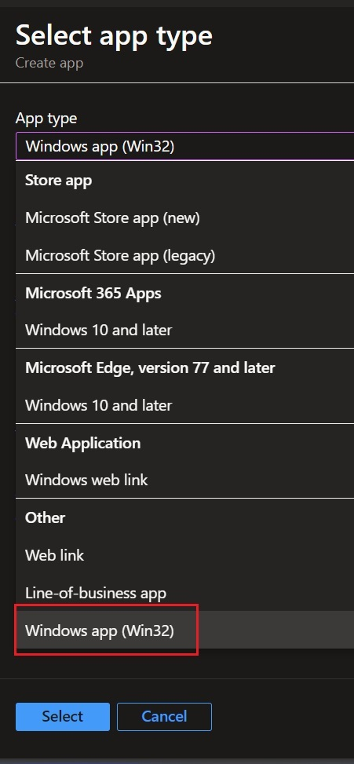
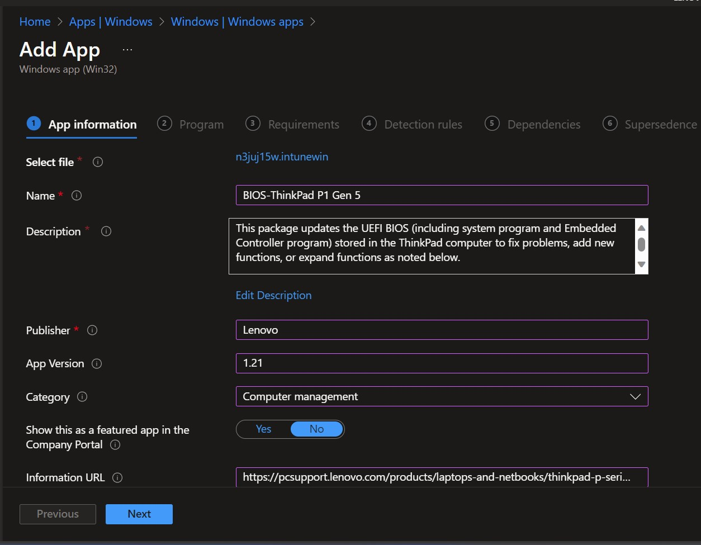
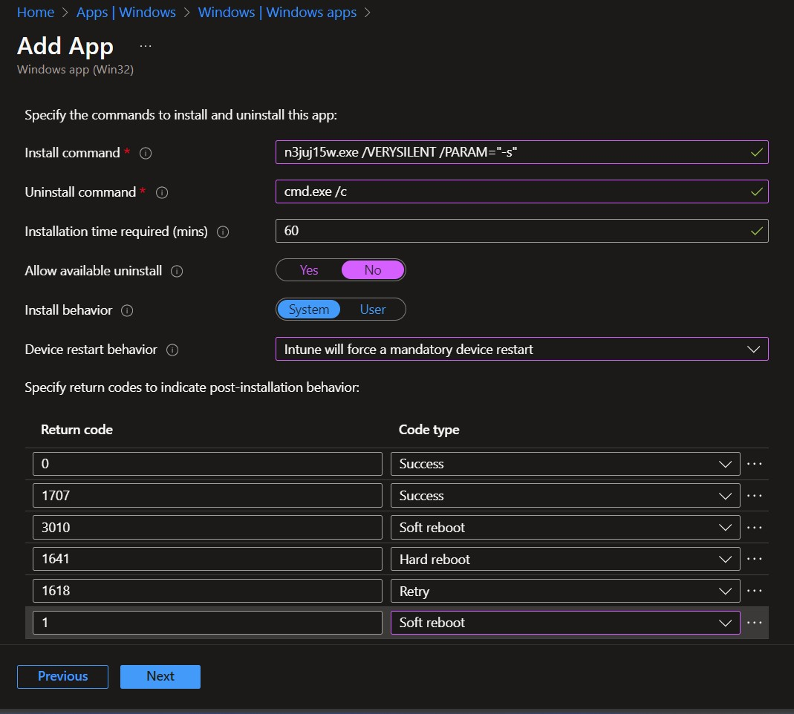
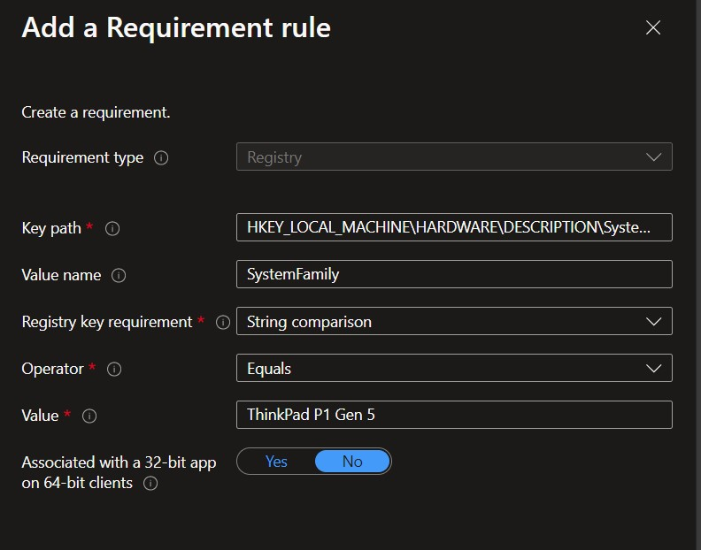
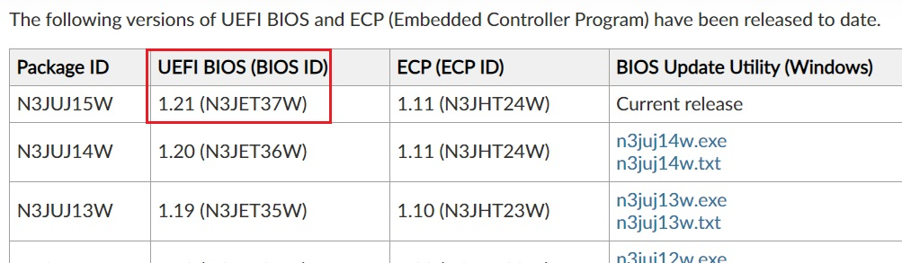
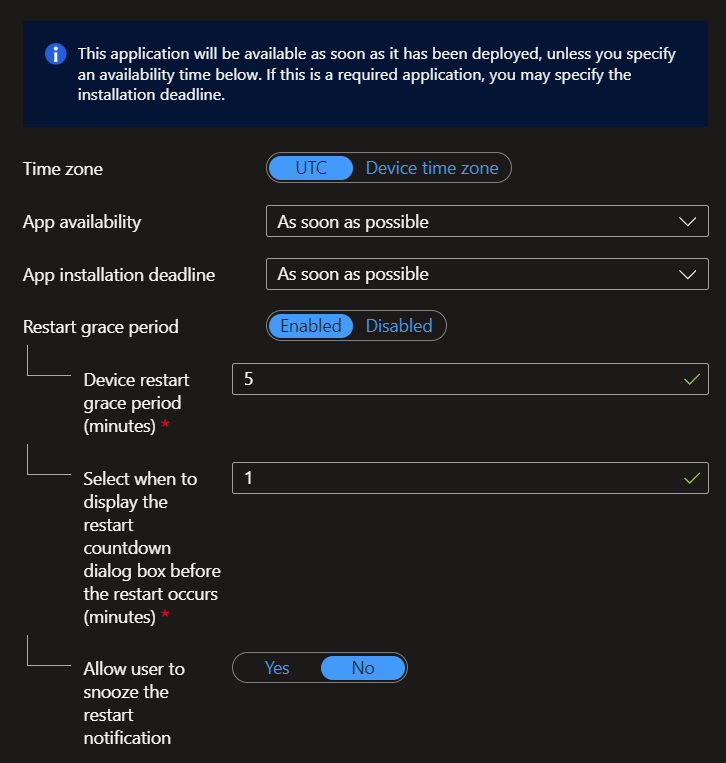
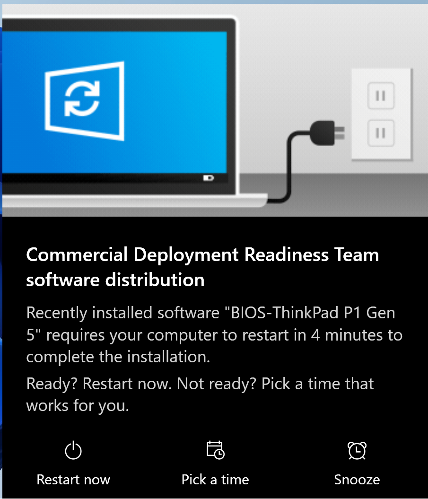
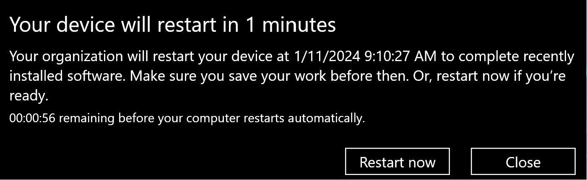

## Deploying ThinkPad BIOS Updates With Intune
*Author: Philip Jorgensen*

This walk-through will cover deploying ThinkPad BIOS updates with Intune. These are provided as standalone executables so adding them as a Win32 client app will involve converting them to the .intunewin format using the [Win32 Content Prep Tool](https://github.com/Microsoft/Microsoft-Win32-Content-Prep-Tool). 

### App Conversion
Create a working folder where the Win32 App Packaging Tool and BIOS packages will reside. Download the latest BIOS for your model system and save it to a working folder. In a PowerShell or Command Prompt, run the **IntuneWinAppUtil.exe** and follow the prompts to:

- Specify the source folder - This is the location where the BIOS package downloaded from the web is saved.
- Setup File - The BIOS package file name, i.e. **r0suj16w.exe**
- Output folder - Location where the converted app will drop.   

Once this information is entered, you will see the tool validate the package parameters, encrypt the content, and generate the detection XML file.  You'll now have a new file in the .intunewin format, which will need to be uploaded into Intune.

### Add the Win32 App
Login to the Microsfoft Endpoint Manager [admin center](https://endpoint.microsoft.com/#blade/Microsoft_Intune_DeviceSettings/AppsWindowsMenu/windowsApps) to add a new Windows app. Choose **Windows app (Win32)** as the app type.



Select the newly created **.intunewin** file to upload

Fill out the required app information and any optional fields.



On the **Program** page, this is where you'll specify the install/uninstall commands. ThinkPad BIOS updates are wrapped as Inno Setup packages that accept the /PARAM parameter and passes it to what is executed normally (Winuptp.exe -s). This is how BIOS updates are done in the Lenovo Updates Catalog for SCUP. The uninstall command is required but in this case, not necessary since you can't uninstall a BIOS update.

**Install command**
```cmd
r0suj16w.exe /VERYSILENT /PARAM="-s"
```

Return Codes isn't a required property to configure but we'll need to add an additional code to verify a successful installation. Click **+Add**, set the value to **1** and select **Soft Reboot** for the code type.  For ThinkPad BIOS, a return code 1 indicates a successful BIOS update and no reboot (a silent install).  You can find a list of Winuptp return codes here.



For **Requirements**, set:
- Operating system architecture - **32-bit/64-bit**
- Minimum operating system - **Windows 10 1607**

Take it a bit further and configure an additional requirement rule to serve as a model check.

**Key path**
```cmd
HKEY_LOCAL_MACHINE\HARDWARE\DESCRIPTION\System\BIOS
```

**Value name**
```cmd
SystemFamily
```

**Value**
```cmd
ThinkPad X380 Yoga
```




**Detection Rules** can be handled several different ways. In this example, I'm choosing to look at the **BIOSVersion** value in the registry. The value in the screenshot below is after installing the latest BIOS update for my test system. This is what will be evaluated at the time of install, so if the client has an older BIOS installed, it should evaluate as **False** and proceed with the install.

?> This detection method assumes a newer BIOS version is being deployed to a system with an older version. If you're attempting to deploy an older BIOS version, the rule will still evaluate as false and attempt to install the older version. If for some reason you're deploying an older BIOS version, make sure the **Secure Rollback Prevention** BIOS setting is disabled.)

**Key path**
```cmd
HKEY_LOCAL_MACHINE\HARDWARE\DESCRIPTION\System\BIOS
```

**Value name**
```cmd
BIOSVersion
```

**Value**: Note the extra space between the 3 and ).
```cmd
R0SET39W (1.23 )
```


I did my testing on an X380 Yoga, so the values will vary across models.  You'll see this data in the registry.


### Assign the App
Target a group for app assignment. If you're going to deploy multiple BIOS updates to different models, it may be a good idea to create a dynamic device group for each model and deploy its own BIOS to that group.  Since I was testing on an X380 Yoga, the below query is what would be used for an X380 Yoga dynamic device group. 

```cmd
(device.deviceModel -startsWith "20LH") -or (device.deviceModel -startsWith "20LJ")
```

### Client Side Experience
Once the app has been deployed, open the Company Portal on the client (if deployed as available) and choose to install the newly delivered app.



You can trace the workflow in the **IntuneManagementExtension.log** located under **C:\ProgramData\Microsoft\IntuneManagementExtension\Logs**. Highlighted below is during the app detection step and installation using the install commands specified.  You'll also see exit code 1 and that it's defined as Soft Reboot.





Once complete, there should be toast notification prompting the user to reboot the system to complete software installation. This can also be seen in the Company Portal.



?> If your laptops are encrypted with BitLocker, this needs to be taken into consideration. It's a best practice to suspend BitLocker prior to flashing the BIOS. ThinkPad BIOS has this check built into Winuptp so if the system is encrypted, Winuptp will suspend encryption behind the scenes once a reboot is triggered. As always, test test test. 