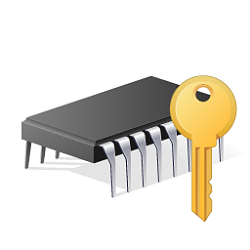
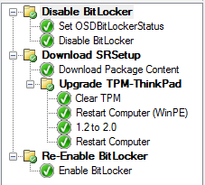
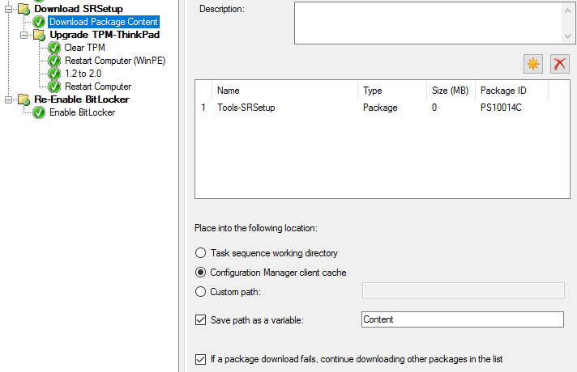
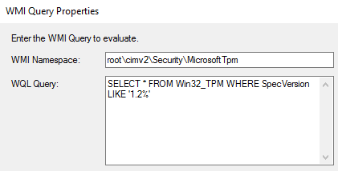
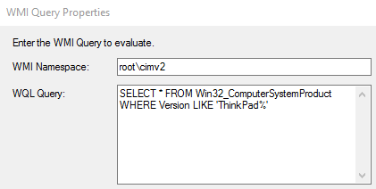
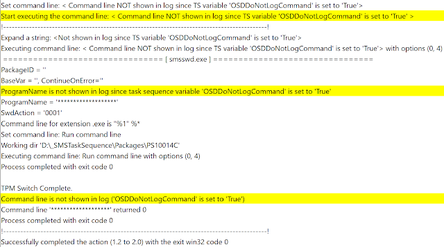

# Upgrading TPM Spec 1.2 to 2.0 <br> on ThinkPad using ConfigMgr Current Branch



---

Now that your Windows 7 to 10 migration is complete, you may want to upgrade the TPM Spec version from 1.2 to 2.0 to take full advantage of Windows 10's security features, like Device Guard and Credential Guard.

This can be accomplished with the ThinkPad Setup Settings Capture/Playback Utility (SRSetupWin).  There's actually two separate utilities, with one supporting a broader range of models so take note of the supported systems sections.  Here's a link to both:

https://pcsupport.lenovo.com/downloads/DS102568

https://pcsupport.lenovo.com/downloads/DS032441

There are caveats when using this tool.  A **Supervisor Password** must be present on the system and the TPM must be cleared prior to converting, which will require physical presence.  That means a tech will have to touch each box.  If you're ok with these requirements and wish to proceed, keep on reading.

?>Supervisor passwords cannot be set initially in an automated way, unless the system supports [System Deployment Boot Mode](https://docs.lenovocdrt.com/#/bios/sdbm).

First, create a Package in your console after you've downloaded and extracted the appropriate utility and distribute the content to your Distribution Points.

**Task Sequence Overview**



**Group 1. Disable BitLocker**

Assuming the systems have already been deployed and are in full OS, you'll need to suspend BitLocker before anything.  I referenced [Mike Terrill's BitLocker template](https://miketerrill.net/2017/04/19/how-to-detect-suspend-and-re-enable-bitlocker-during-a-task-sequence/) for this.

**Group 2. Download SRSetup**

Add a Download Package Content Step, specifying the Package created earlier containing SRSetup. I'm choosing to drop into the ccmcache directory and saving the path as a variable named Content.



**Group 3. Upgrade TPM-ThinkPad**

I added the following 2 conditions on this group.





**Clear TPM**

Add a Run PowerShell Script step to clear the TPM
```powershell
Get-CimInstance -Namespace root/cimv2/Security/MicrosoftTpm -ClassName Win32_TPM | Invoke-CimMethod -MethodName SetPhysicalPresenceRequest -Arguments @{Request='14'}
```

**Restart Computer (WinPE)**

Add a Restart Computer step, selecting to boot to the Boot Image.  This prevents Windows from automatically taking ownership of the TPM, allowing you to perform the upgrade successfully.

**Upgrade from 1.2 to 2.0**

Add a Run Command Line step with the command being

```
srsetupwin64.exe /z /fTPM /q /APAP yourbiossupervisorpassword
```

*or*

```
srsetupewin64.exe /z /fTPM /q /APAP yourbiossupervisorpassword
```

The /Z switch is undocumented and must be done independently from other BIOS settings changes.  If you have a mix of systems that require you to use both utilities, define conditions on each step to determine which utility executes against the supported system.  WMI logic to query the Win32_ComputerSystemProduct namespace and Version property would suffice.

In the **Start in:** field, enter %Content01%


Add a Restart Computer step (back into OS) followed by a group to Re-Enable BitLocker.  Once you're logged back in, you can confirm the TPM Spec Version in the TPM Management Console.

A new task sequence variable **OSDDoNotLogCommand** was introduced in ConfigMgr version 1806. When set to True, sensitive data is prevented from being displayed or logged. This only applied to the Install Package step. In version 1902, this variable now applies to Run Command Line steps. If you prefer not having your Supervisor password in clear text, set this variable to True. Here's an example of what this will look like in your log once the srsetup utility is executed:



---
*Further Reading*

SetPhysicalPresenceRequest method of the Win32_Tpm class: https://docs.microsoft.com/en-us/windows/desktop/SecProv/setphysicalpresencerequest-win32-tpm

Download Package Content: https://docs.microsoft.com/en-us/sccm/osd/understand/task-sequence-steps#BKMK_DownloadPackageContent

Task Sequence Variable Reference: https://docs.microsoft.com/en-us/sccm/osd/understand/task-sequence-variables