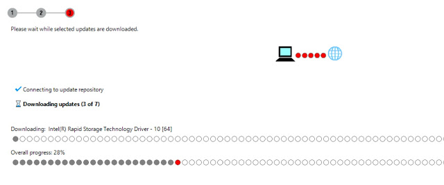
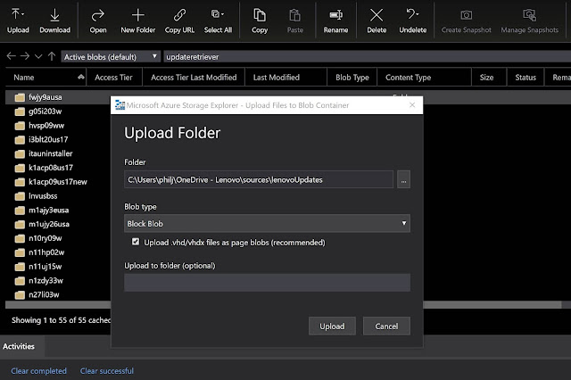
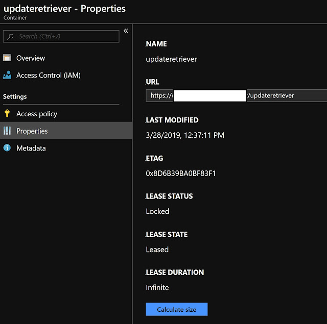

# Hosting a repository in an Azure blob

 

?>System Update v5.07.0110 and later supports Blob storage access via HTTPS

When it comes to managing a centralized Update Retriever repository, challenges arise with widely distributed environments.  This is where leveraging a cloud storage solution can bring value.

This post may be helpful for anyone piloting a "modern" way of updating their Think products.  This walk-through assumes the following tools are in place:

* [Update Retriever](https://support.lenovo.com/solutions/ht037099#ur)
* [Thin Installer](https://support.lenovo.com/solutions/ht037099#ti) or [System Update](https://support.lenovo.com/solutions/ht037099#tvsu) on the client
* [Azure Blob](https://docs.microsoft.com/azure/storage/blobs/storage-quickstart-blobs-portal) Container (a free trial account with an included 5gb limit is what I used here)

I won't cover creating the Storage account or Blob, just the process of uploading the Update Retriever content to the Blob container and how to configure the ThinInstaller Configuration XML on the client.  Note though, the Container access level should be set to **Blob (anonymous read access for blobs only)**.

## Populating the Update Retriever repository

First, you'll need to download any new updates to your local machine or network share.  Currently, you can only set a repository location to a local drive or UNC path.



You can take advantage of configuring your Update Retriever repository as a "Lenovo cloud repository" so that only the package XML's will be downloaded rather than the full updates.  This process is covered [here](https://thinkdeploy.blogspot.com/2020/05/deep-dive-setting-up-lenovo-cloud.html).  Once all updates are downloaded successfully, you'll need to upload them to the Blob.  There's a few different ways to accomplish this. 

* Install [Azure Storage Explorer](https://azure.microsoft.com/features/storage-explorer/) and upload the folder containing the updates, database.xml, and database.xsd.
* Upload the content using [AzCopy](https://docs.microsoft.com/azure/storage/common/storage-use-azcopy) (latest version can be downloaded [here](http://aka.ms/downloadazcopy))
* Upload the content using the [Set-AzStorageBlobContent](https://docs.microsoft.com/powershell/module/azure.storage/set-azurestorageblobcontent?view=azurermps-6.13.0) cmdlet.

**Method 1: Storage Explorer** Authenticate to your Storage account, navigate to the folder containing your updates and choose to upload by folder.



Once complete, you should see all data uploaded in the Activities pane.


**Method 2: AzCopy** You'll need a few more pieces of information before uploading with AzCopy.

* Blob Container URL (Storage Account/Blobs/Blob Container/Properties)



* [Storage Account Access Keys](https://docs.microsoft.com/azure/storage/common/storage-account-manage#access-keys) (*There will be 2 keys presented.  Either can be used*) or a [SAS token](https://docs.microsoft.com/azure/storage/common/storage-dotnet-shared-access-signature-part-1).  It's highly recommended to use a SAS token.


With this information, you should now be able to upload the content.  Starting in AzCopyv10, you can sync directories.  Here's a sample command to execute using AzCopy:

```cmd
AzCopy.exe sync 'C:\lenovoUpdates' 'https://your-blob.core.windows.net/updateretriever<SASToken>' --delete-destination true
```

The results will look something like this


**Method 3: PowerShell** Similar to AzCopy but instead using the **Set-AzStorageBlobContent** cmdlet.  You'll need the [Azure PowerShell module](https://docs.microsoft.com/powershell/azure/install-az-ps?view=azps-1.7.0) installed first.  Below is a simple, sample script that was pieced together from the examples provided by the MS docs.

```powershell
$srcPath = "C:\lenovoUpdates"
$token = "your-sas-token"
$containerName = 'your-container-name'
$storageContext = New-AzStorageContext -StorageAccountName 'your-storage-account' -SasToken $token

ls -File $srcPath -Recurse | Set-AzStorageBlobContent `
  -Container $containerName `
  -BlobType Block `
  -Context $storageContext -Force
```

An example capture once the upload kicks off


## Client side configuration

### Thin Installer

Now that the repository is ready, you'll need to make a quick change to the Thin Installer Configuration XML to direct the client to the Blob container.  Open the **ThinInstaller.exe.configuration** file and set the new repo path the Blob Container URL as noted earlier. 


When Thin Installer is launched it will connect to the Update Retriever repository in Azure.


### System Update

Simply update the **AdminCommandLine** registry value to point to your Blob URL.  An example command line would be:

```cmd
/CM -search A -action LIST -includerebootpackages 1,3,5 -packagetypes 1,2,3,4 -nolicense -repository https://yourblob.blob.core.windows.net/repository -exporttowmi 
```

Refer to the System Update Suite Deployment [Guide](https://docs.lenovocdrt.com/#/su/su_dg/su_dg) for available command line options.
