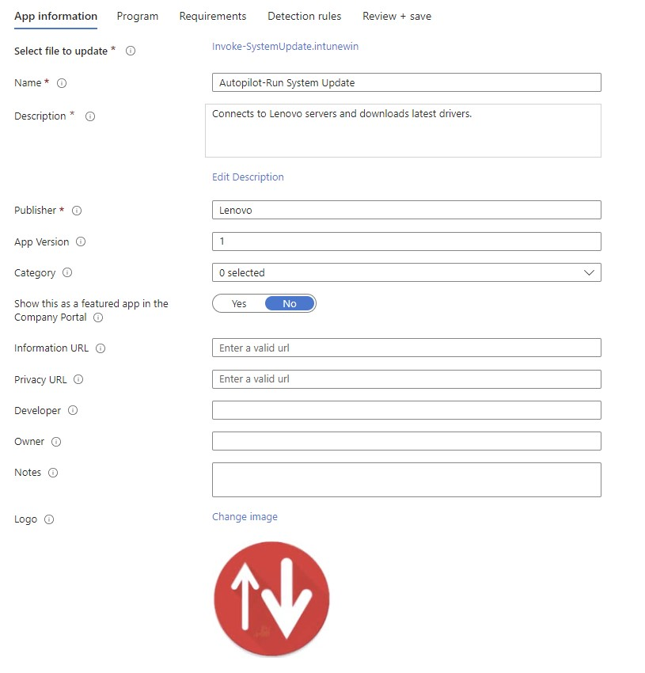
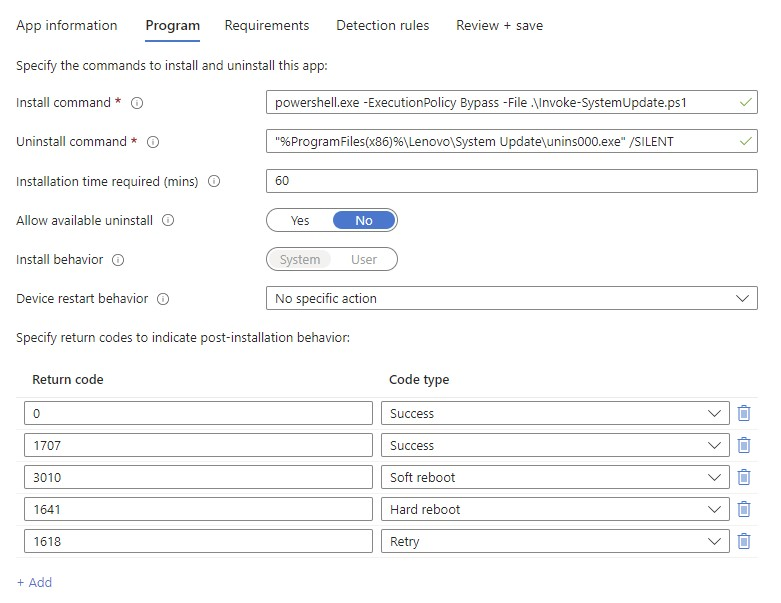
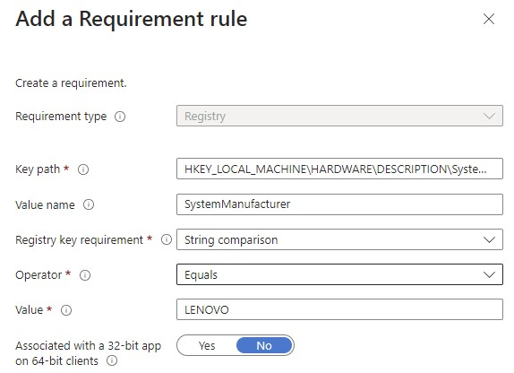
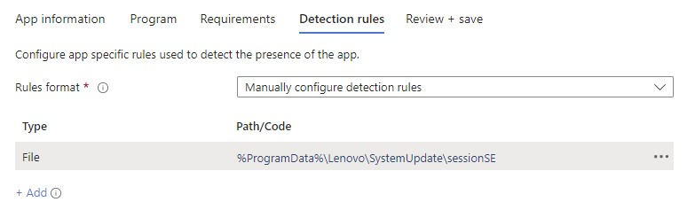
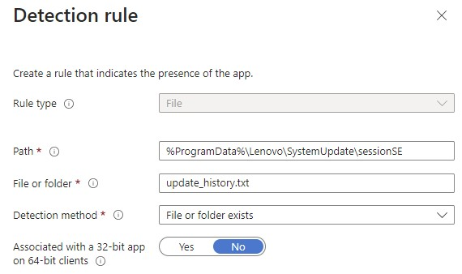

# Autopilot + System Update = Latest drivers
*Author: Philip Jorgensen*

---

This post walks you through updating your Think product's drivers during [Windows Autopilot](https://docs.microsoft.com/en-us/mem/autopilot/windows-autopilot) using Lenovo System Update.

Ideally, you'll want the most current drivers installed on the device prior to the user's first sign-in.  

Pre-req's:

- Latest version of [System Update](https://support.lenovo.com/downloads/ds012808-lenovo-system-update-for-windows-10-7-32-bit-64-bit-desktop-notebook-workstation)
- Microsoft's Win32 Content Prep [tool](https://github.com/Microsoft/Microsoft-Win32-Content-Prep-Tool)
- Sample PowerShell script that performs the following:
    - Installs System Update
    - Sets the AdminCommandLine registry value that will:
        - Download/install type 3 packages (drivers only). More info on package types can be found in the updated Deployment [Guide](https://docs.lenovocdrt.com/#/su/su_dg).
        - Writes the installation status of each update to WMI.
    - Configures the System Update UI
    - Disables the default scheduled tasks created by System Update.
    - Sets a custom scheduled task for System Update to run. Adjust to what makes sense for your environment.

Save the below as **Invoke-SystemUpdate.ps1** (also on my [GitHub](https://github.com/philjorgensen/Intune/blob/main/Autopilot/Invoke-SystemUpdate.ps1))
```powershell
<# 
DISCLAIMER: 

These sample scripts are not supported under any Lenovo standard support   

program or service. The sample scripts are provided AS IS without warranty   

of any kind. Lenovo further disclaims all implied warranties including,   

without limitation, any implied warranties of merchantability or of fitness for   

a particular purpose. The entire risk arising out of the use or performance of   

the sample scripts and documentation remains with you. In no event shall   

Lenovo, its authors, or anyone else involved in the creation, production, or   

delivery of the scripts be liable for any damages whatsoever (including,   

without limitation, damages for loss of business profits, business interruption,   

loss of business information, or other pecuniary loss) arising out of the use   

of or inability to use the sample scripts or documentation, even if Lenovo   

has been advised of the possibility of such damages.  
#> 

<#
.SYNOPSIS
    Script to install and configure Lenovo System Update. 

.DESCRIPTION
    Script will install Lenovo System Update and set the necessary registry subkeys and values that downloads/installs 
    reboot type 3 packages on the system.  Certain UI settings are configured for an optimal end user experience.
    The default Scheduled Task created by System Update will be disabled.  A custom Scheduled Task for System Update will be created.

.NOTES
    FileName: Invoke-SystemUpdate.ps1
    Author: Philip Jorgensen
    
    Update the $pkg variable with the version you plan on installing
#>

##### Install System Update
$pkg = "system_update_5.07.0110"
$switches = "/verysilent /norestart"
Start-Process ".\$pkg" -ArgumentList $switches -Wait

##### Set SU AdminCommandLine
$RegKey = "HKLM:\SOFTWARE\Policies\Lenovo\System Update\UserSettings\General"
$RegName = "AdminCommandLine"
$RegValue = "/CM -search A -action INSTALL -includerebootpackages 3 -noicon -noreboot -exporttowmi"

# Create Subkeys if they don't exist
if (!(Test-Path $RegKey)) {
    New-Item -Path $RegKey -Force | Out-Null
    New-ItemProperty -Path $RegKey -Name $RegName -Value $RegValue | Out-Null
}
else {
    New-ItemProperty -Path $RegKey -Name $RegName -Value $RegValue -Force | Out-Null
}

##### Configure SU interface
$ui = "HKLM:\SOFTWARE\WOW6432Node\Lenovo\System Update\Preferences\UserSettings\General"
$values = @{

    "AskBeforeClosing"     = "NO"

    "DisplayLicenseNotice" = "NO"

    "MetricsEnabled"       = "NO"
                             
    "DebugEnable"          = "YES"

}

if (Test-Path $ui) {
    foreach ($item in $values.GetEnumerator() ) {
        New-ItemProperty -Path $ui -Name $item.Key -Value $item.Value -Force
    }
}

<# 
Run SU and wait until the Tvsukernel process finishes.
Once the Tvsukernel ends, Autopilot flow will continue.
#>
$su = Join-Path -Path ${env:ProgramFiles(x86)} -ChildPath "Lenovo\System Update\tvsu.exe"
& $su /CM | Out-Null
Wait-Process -Name Tvsukernel

# Disable the default System Update scheduled tasks
Get-ScheduledTask -TaskPath "\TVT\" | Disable-ScheduledTask

##### Disable Scheduler Ability.  
# This will prevent System Update from creating the default scheduled tasks when updating to future releases.
$sa = "HKLM:\SOFTWARE\WOW6432Node\Lenovo\System Update\Preferences\UserSettings\Scheduler"
Set-ItemProperty -Path $sa -Name "SchedulerAbility" -Value "NO"

##### Create a custom scheduled task for System Update
$taskAction = New-ScheduledTaskAction -Execute $su -Argument '/CM'
$taskTrigger = New-ScheduledTaskTrigger -Weekly -DaysOfWeek Monday -At 9am
$taskUserPrincipal = New-ScheduledTaskPrincipal -UserId 'SYSTEM'
$taskSettings = New-ScheduledTaskSettingsSet -Compatibility Win8
$task = New-ScheduledTask -Action $taskAction -Principal $taskUserPrincipal -Trigger $taskTrigger -Settings $taskSettings
Register-ScheduledTask -TaskName 'Run-TVSU' -InputObject $task -Force
```

### Preparing the Win32 App
Once all pre-requisites are downloaded to a source location, run the Content Prep tool to package the content as an **.intunewin** package. A sample command would be:
```cmd
IntuneWinAppUtil.exe -c "C:\SU\" -s "Configure-TVSUandScheduledTask.ps1" -o "C:\SU\output"
```


### Add Win32 App
Add a new Windows app in the MEM admin center, and choose the **Windows app (Win32)** app type.  Select the .intunewin app created earlier and click ok to upload.

Fill out the necessary information for each section.



For the Install command enter the following:
```cmd
powershell.exe -ExecutionPolicy Bypass -File .\Configure-TVSUandScheduledTask.ps1
```
Since there's no uninstall, just enter cmd.exe /c 



Additional Requirement type: **Registry**
- Key path: **HKEY_LOCAL_MACHINE\HARDWARE\DESCRIPTION\System\BIOS**
- Value name: **SystemManufacturer**
- Registry key requirement: **String comparison**
- Operator: **Equals**
- Value: **LENOVO**
This ensures the app will only run on Lenovo systems



Detection rule type: **File**



- Path: **%ProgramData%\Lenovo\SystemUpdate\sessionSE**
- File or folder: **update_history.txt**
- Detection method: **File or folder exists**



The update_history.txt is generated since we're specifying the **-exporttowmi** switch in the AdminCommandLine.  Since the system will be going through Autopilot for the first time, this obviously won't be present.

Assign the app to a group containing Autopilot registered devices.

If you already have an Enrollment Status Page profile configured, add this app to the list of selected apps that are required to install before the device can be used.  This ensures System Update completes before proceeding to the next phase.


### Viewing the Results
A look through the IntuneManagementExtension.log, you'll see the update_history.txt file was not detected


Several minutes later, it's now detected


You can then run the following PowerShell command to see which updates were installed

```powershell
Get-ChildItem -Path C:\ProgramData\lenovo\SystemUpdate\sessionSE\update_history.txt | Select-String -SimpleMatch "Success" | fl Line
```

The screenshot below shows the results from a ThinkPad T480s preloaded with Windows 10 1903. 13 drivers updated successfully!

