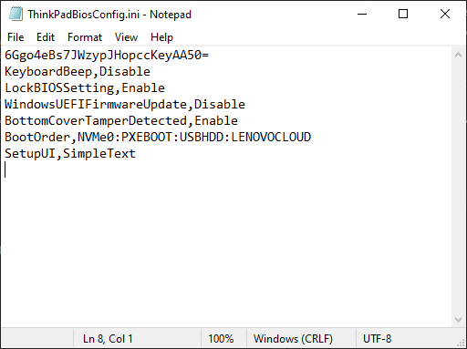
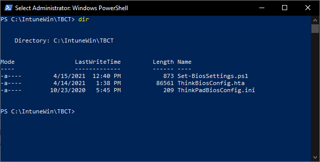
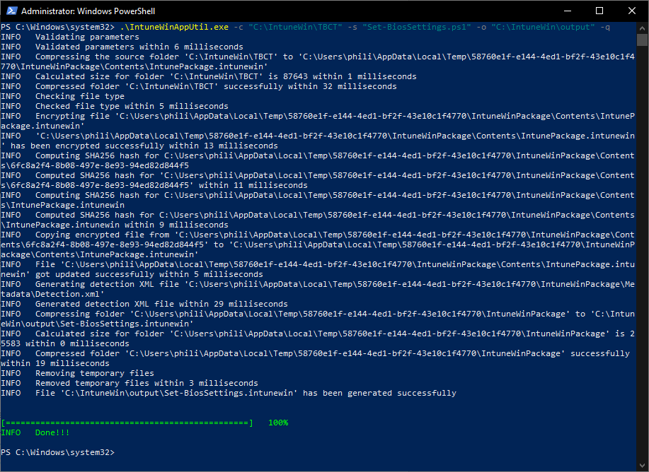
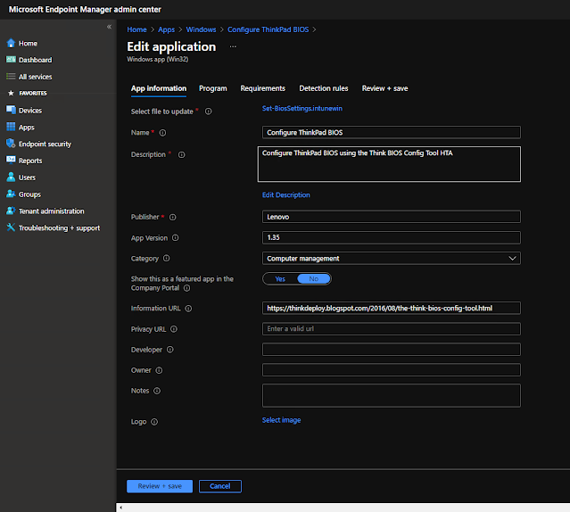
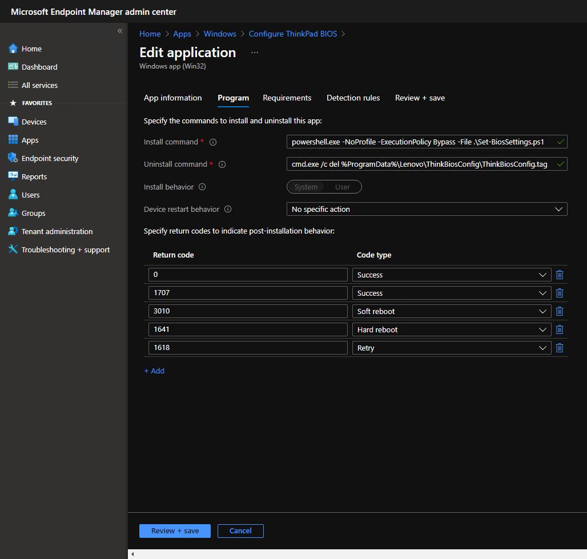
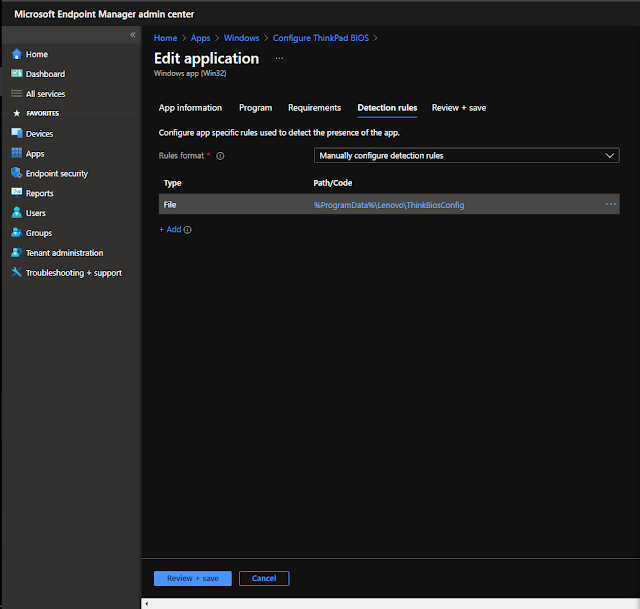

### Configure BIOS Settings Through Intune using the Think BIOS Config Tool
*Author: Philip Jorgensen*

There are numerous articles out in the community that walk through how to configure BIOS settings through Intune.  The majority of them being PowerShell solutions.  

This post will provide an alternate method for configuring BIOS settings using our official [Think BIOS Config HTA](https://docs.lenovocdrt.com/#/tbct/tbct_top) that was introduced back in 2016.  This solution can also be leveraged as part of an Autopilot deployment.

Before proceeding, make sure you have an exported .ini file that contains the desired BIOS settings you want applied to your target systems.   Refer to the documentation provided in the TBCT zip on how to obtain this file.  For this demonstration, I've exported the following .ini from a T14s (Intel)



Since my target systems have a Supervisor password already set, the first line is the encrypted Supervisor password which was created using the specified secret key as part of the tool's capture process.  Note, there's no way to set an initial Supervisor password with this tool.

**Preparing the Win32 App source files**

Create a temporary directory and place the HTA, .ini file, and the following sample PowerShell script (save as a .ps1), which will be used to call the tool and apply the .ini.

Note: The $arg variable is critical as this holds the file and password switches.  You'll need to replace ThinkPadBiosConfig.ini to whatever you named your .ini file.  Replace secretkey to the encrypting key you specified during the capture process.

```powershell
$tag = "$($env:ProgramData)\Lenovo\ThinkBiosConfig\ThinkBiosConfig.tag"
$arg = '"file=ThinkPadBiosConfig.ini" "key=secretkey"'
$log = '"log=%ProgramData%\Lenovo\ThinkBiosConfig\""'

try {
    if (!(Test-Path -Path $tag -PathType Leaf)) {
        Write-Host "Creating TBCT directory..."
        New-Item -ItemType File -Path $tag -Force -ErrorAction Stop
        Set-Content -Path $tag -Value "Bios Settings Configured"
        Write-Host "Tag file created..."

        Start-Process cmd.exe -ArgumentList "/C ThinkBiosConfig.hta $arg $log" -NoNewWindow -Wait
        Write-Host "Bios Settings Configured"
        Exit 3010
    }
    else {
        Write-Host "Bios Settings already configured..."
        Exit 0
    }
}
catch [System.IO.IOException] {
    Write-Host "$($_.Exception.Message)"
}
catch {
    Write-Host "$($_.Exception.Message)"
}
```

Your directory should have 3 items



**Create and Upload the Win32 App**

We're going to use the Win32 Content Prep [tool](https://github.com/Microsoft/Microsoft-Win32-Content-Prep-Tool) to create an .intunewin file that will be uploaded to Intune.



Once the .intunewin file has been created, sign into the MEM [admin center](https://endpoint.microsoft.com/#blade/Microsoft_Intune_DeviceSettings/AppsWindowsMenu/windowsApps) and create a new Windows client app.  Choose **Windows app (Win32)** for the app type and select the .intunewin package file to upload.

Specify the **App Information**



Enter the **Install** command
```
powershell.exe -NoProfile -ExecutionPolicy Bypass -File .\Set-BiosSettings.ps1
```
and **Uninstall** command
```
cmd.exe /c del %ProgramData%\Lenovo\ThinkBiosConfig\ThinkBiosConfig.tag
```




Set Operating system architecture to **64-bit** and Minimum operating system to **Windows 10 1607**

Add a Registry requirement type rule to check the target system is Lenovo (Optional)

Key path: **HKEY_LOCAL_MACHINE\HARDWARE\DESCRIPTION\System\BIOS**

Value name: **SystemManufacturer**

Registry key requirement: **String comparison**

Operator: **Equals**

Value: **LENOVO**


Add a File type rule to check for the presence of the tag that gets created by the PowerShell script.  We'll use this for the detection method.

Path: **%ProgramData%\Lenovo\ThinkBiosConfig**

File or folder: **ThinkBiosConfig**

Detection method: **File or folder exists**



Finally, Review + Save to create the new app and deploy to a Device Group.  

On my test machine, I see toast notifications that show the BIOS has been configured and to reboot.


The tool generates a log file so here you can see my Supervisor password has been validated with the encrypting key and the settings have been applied successfully.


?>**Additional Notes:** 

- You can combine settings across different products into a single .ini and apply them to all of your devices which use the same BIOS password (only one password can be specified per .ini file).  There may be a BIOS setting from one device with a value of **Enabled** whereas another device's value is **Enable**.  For example: LockBIOSSetting,**Enable** vs. LockBIOSSetting,**Enabled** If one doesn't apply to a device, it will simply skip it.
- If you choose to deploy this as a Required app for Autopilot devices, the dreaded reboot during ESP will occur, resulting in the extra user login.