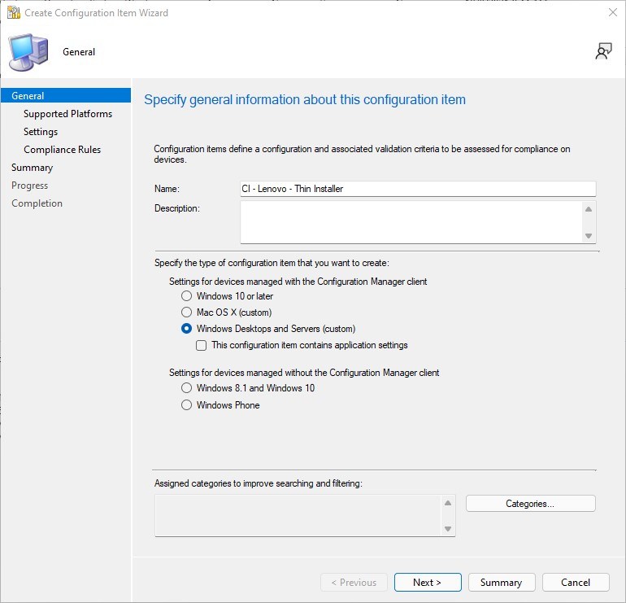
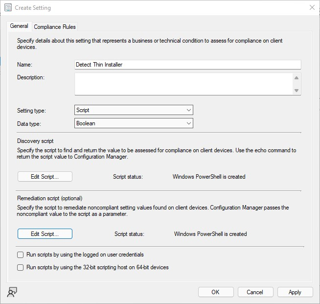
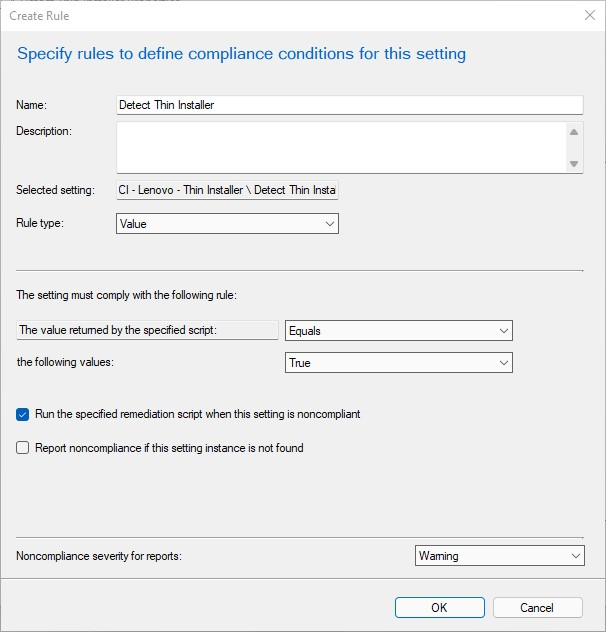
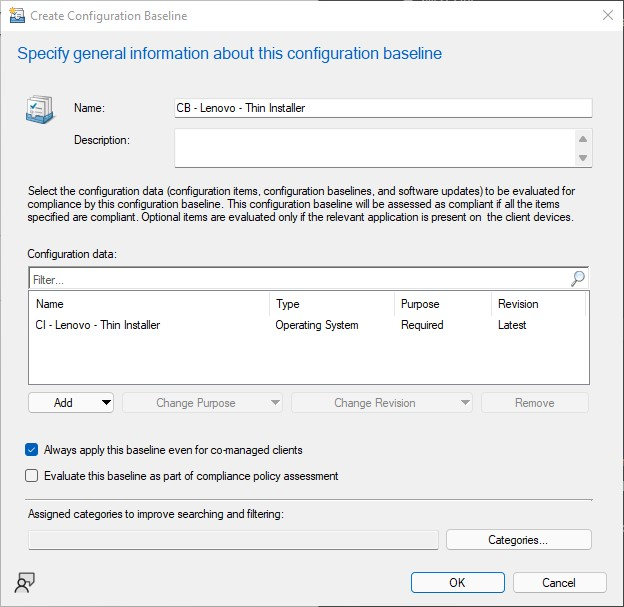
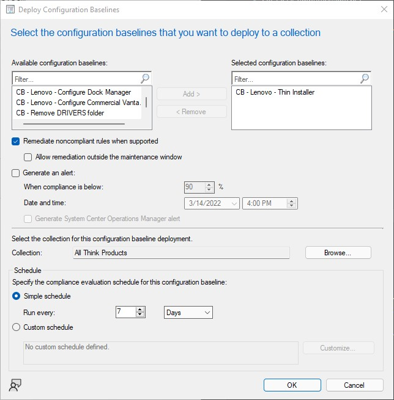
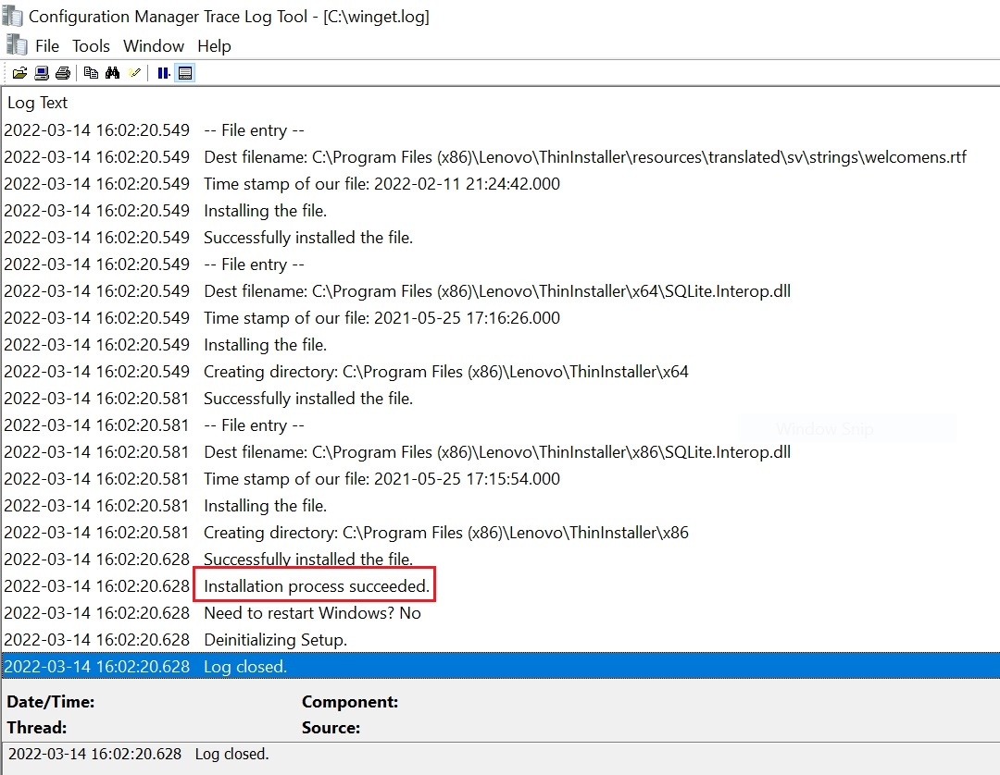

### Using Winget to Install Applications as Part of a <br> Configuration Manager Configuration Baseline
*Author: Philip Jorgensen*

---
**Brief Background**

The future of package management for Windows is [Windows Package Manager](https://docs.microsoft.com/en-us/windows/package-manager/). This simplifies the installation and management of applications using the winget [tool](https://docs.microsoft.com/en-us/windows/package-manager/winget/). 

There is a community [repository](https://github.com/microsoft/winget-pkgs) that contains all of the package manifest files for Windows. Browsing through the repository, I noticed Lenovo System Update (and its many previous versions) had already been submitted by other contributors. I thought to myself, "*We should add our other enterprise [tools](https://support.lenovo.com/solutions/ht037099) to the list.*" We now have available in the repository:

- **Dock Manager**
- **Update Retriever**
- **Thin Installer**
- **System Update**

Early on during my testing with winget, the ultimate goal was to be able to install applications in System context. The struggle was that winget isn't recognized if you try to call it in System context. There was, however, an alternate solution by using **AppInstallerCli.exe**. I wrote a short [script](https://github.com/philjorgensen/Winget/blob/main/Set-WingetScheduledTask.ps1) on how to leverage this to upgrade packages with a Scheduled Task.

After revisiting winget, I noticed **AppInstallerCli.exe** wasn't present anymore. On my test machine, the Desktop App Installer package had updated to version **1.17.10271** from version **1.16.12653**. Instead, I did see **winget.exe** in the root of the **Microsoft.DesktopAppInstaller** directory. In previous versions, this was located under **%LocalAppData%\Microsoft\WindowsApps**, where it still is but it appears Microsoft has listened to the community on wanting support for this in System context.

?>Winget releases can be found at https://github.com/microsoft/winget-cli/releases

Which now leads us to the purpose of this article. How can I remediate a device missing a critical application using a [Configuration Baseline](https://docs.microsoft.com/en-us/mem/configmgr/compliance/deploy-use/deploy-configuration-baselines)? What makes this even more attractive, is that I don't have to create an Application and retain the source files.

I'll use Thin Installer for this demonstration.

**Create the Configuration Item**

Start off by navigating to the **Assets and Compliance** workspace in the console, expand **Compliance Settings**, and select **Configuration Items**. Click **Create Configuration Item** from the ribbon bar and enter a name for the CI.



I specified Windows 10 and Windows 11 for **Supported Platforms**


Add a new setting, choose **Script** for the setting type and **Boolean** for data type.



Click **Edit Script...** in the **Discovery script** section. Choose **Windows PowerShell** as the script language and copy/paste the code below

```powershell
$ThinInstaller = Join-Path -Path (Join-Path -Path ${env:ProgramFiles(x86)} -ChildPath Lenovo) -ChildPath "ThinInstaller"
if (Test-Path -Path $ThinInstaller)
{ return $true }
else { return $false }
```

Copy/paste the below code to be used for the **Remediation script**.

```powershell
$Winget = Get-ChildItem -Path (Join-Path -Path (Join-Path -Path $env:ProgramFiles -ChildPath "WindowsApps") -ChildPath "Microsoft.DesktopAppInstaller*_x64*\winget.exe")
$Id = "Lenovo.ThinInstaller"

try {
    Invoke-Expression -Command "cmd.exe /c '$Winget' install --id $Id --scope machine --silent --accept-source-agreements --accept-package-agreements --log C:\Winget-ThinInstaller.log"
}
catch {
    Throw "Failed to install Thin Installer"
}
```

Configure the compliance condition rule as:
- Rule type - **Value**
- The value returned by the specified script - **Equals** **True**
- Tick the box to **Run the specified remediation script when this setting is noncompliant**



Complete the wizard to create the new Configuration Item.

Navigate to the **Configuration Baselines** node. Click **Create Configuration Baseline** in the ribbon bar. Specify a name, add the CI that was just created, and lick Ok.



**Deploy** the baseline to a Collection. Tick the box to **Remediate noncompliant rules when supported**.



Hop over to a test machine and open the Configuration Manager Client Applet to force a machine policy retrieval. Once the new baseline appears under the **Configurations** tab, click **Evaluate** and wait for the magic to happen. When the baseline completes, scroll over to the **Compliance** column to confirm the status shows **Compliant**.

The remediation script also outputs the winget log to **C:\Winget-ThinInstaller.log**. Open it up and near the bottom you should see **Installation process succeeded**



This is a simple example of what can be possible with winget moving forward. At the time of testing, I also attempted to deploy this same remediation script through Intune as a Win32 app but it fails. I have no idea why since the process is essentially the same. This article will be updated once that's solved.