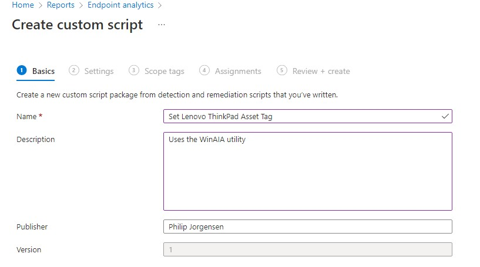
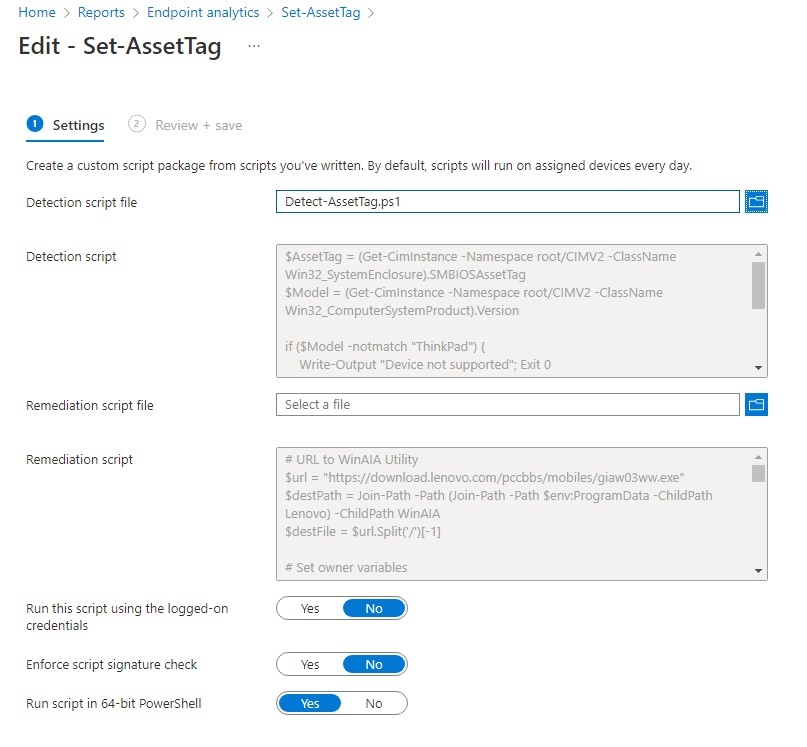

# Setting an Asset Tag on ThinkPads using Intune Proactive Remediations

For the unaware, Lenovo provides a [Windows Utility to Read and Write Asset ID Information](https://support.lenovo.com/downloads/ds039503), specifically for ThinkPad. With this utility, you are able to set asset ID data such as an Owner Name, Owner Location, Asset Number and several other pieces of information.

Refer to the [ReadMe](https://download.lenovo.com/pccbbs/mobiles/giaw03ww.txt) for all available group names and their associated fields, as well as supported models.

?> The USERASSETDATA.ASSET_NUMBER is available through WMI by querying the SMBIOSAssetTag field of the Win32_SystemEnclosure class.

This solution will focus on setting:
- **Asset Tag**
- **Owner Name**
- **Department**
- **Location**

## Intune Requirements

Device must be enrolled into [Endpoint Analytics](https://docs.microsoft.com/mem/analytics/enroll-intune)

Valid licenses for enrolled devices to use Microsoft Endpoint Manager.

- [Intune Licensing](https://docs.microsoft.com/mem/intune/fundamentals/licenses)
- [ConfigMgr Licensing](https://docs.microsoft.com/mem/configmgr/core/understand/learn-more-editions)

## Proactive Remediations

?> Detection/Remediation scripts can be downloaded on my [GitHub](https://github.com/philjorgensen/Intune/tree/main/Proactive%20Remediations/Asset%20Tag)

Sign-in to the Microsoft Endpoint Manager [admin center](https://endpoint.microsoft.com/#home) and navigate to **Reports > Endpoint Analytics > Proactive Remediations**

Click **Create new script package**. Provide a Name and description (if necessary)

On the **Settings** section, upload both the **Detection script file** and the **Remediation script file** by browsing to the location where the **.ps1** files were saved.

Configure the option to **Run script in 64-bit PowerShell** to Yes

Assign any scope tags and a group to deploy the script package to. For testing purposes, I set the schedule to run every hour.

?> A reboot is required before the tag is populated in WMI.

## Monitor script package

Check the overview of your detection and remediation status under **Reporting > Endpoint Analytics - Proactive remediations**. Review the **Device status** to get details for each device.

!> Remember to change the Owner Data variables in the remediation script. The USERASSETDATA.ASSET_NUMBER is based off the UniqueID of the device and is what I decided to use for this scenario.
