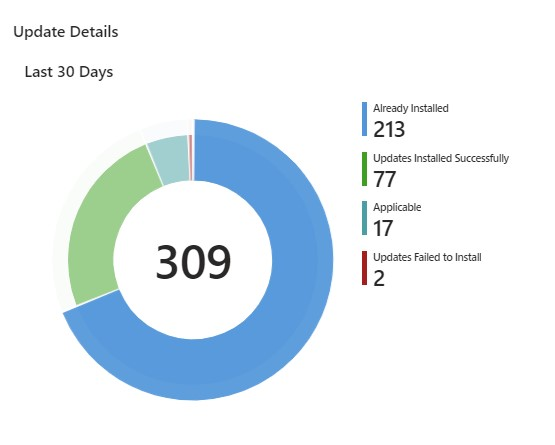
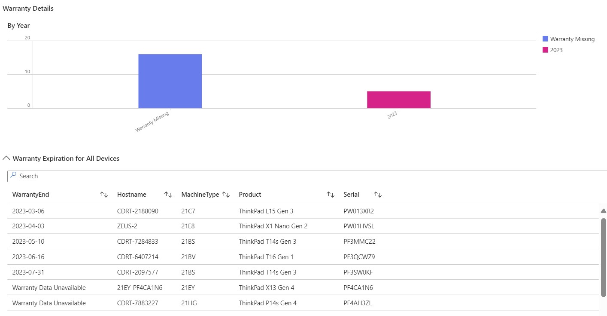

# Intune Reporting: Update Status, Battery Health, and Warranty Info

This post will walk through deploying a [Proactive Remediation](https://learn.microsoft.com/mem/analytics/proactive-remediations) script that will collect data from specific Lenovo WMI classes using the [HTTP Data Collector API](https://learn.microsoft.com/azure/azure-monitor/logs/data-collector-api). As a result, the data will be sent to a [Log Analytics Workspace](https://learn.microsoft.com/azure/azure-monitor/logs/log-analytics-workspace-overview) in Azure Monitor.

We can then create an [Azure Monitor Workbook](https://learn.microsoft.com/azure/azure-monitor/visualize/workbooks-overview) to report on the following data from your Lenovo devices

## Update Installation Status

> Lists all updates by package ID and title with their respective install statuses

---

## Battery Health Status

> Lists all endpoints and health of their battery (Good/Bad)

---

## Warranty End Date

> Lists the warranty end dates of all endpoints

## **Prerequisites**

This is all dependent on [Lenovo Commercial Vantage](https://support.lenovo.com/solutions/hf003321-lenovo-vantage-for-enterprise) being installed on your endpoints.

?> For a step by step guide on how to deploy Commercial Vantage through Intune, refer to this blog [article](https://blog.lenovocdrt.com/#/2020/cv_intune_deploy).

The following policies need to be enabled in order to create the WMI namespaces that will be inventoried, along with their respective classes

    - Configure System Update
    - Write warranty information to WMI table
    - Write battery information to WMI table

### Required Files

Get-LenovoDeviceStatus.ps1

Workbook.json

## **Log Analytics Workspace**

Assuming a Log Analytics Workspace has been created, you'll need the **Workspace ID** and **Primary Key**. This can be found under **Agents management** of your workspace.

## Deploying the Proactive Remediation Script Package

Once you have Commercial Vantage installed and the necessary policies enabled on your endpoints, it's time to deploy a Proactive Remediation script to collect inventory.

!> Replace the **$customerID** and **$sharedKey** variables in the **Get-LenovoDeviceStatus.ps1** script

- Login to the Microsoft Endpoint Manager [admin center](https://endpoint.microsoft.com)
- Navigate to **Reports** > **Endpoint Analytics** > **Proactive remediations**
- Click **Create script package**
- Enter a name for the script package and click **Next**
- Browse to **Get-LenovoDeviceStatus.ps1** for the **Detection script file**
- Select **Yes** to **Run script in 64-bit PowerShell** and click **Next**
- Assign to a group and set the schedule for the script package to run.
- **Create**

As devices receive the policy, review the **Device status** blade to verify if devices don't have Commercial Vantage installed or the necessary policies enabled. You can review this by adding the **Pre-remediation detection output** column. If there's no issue, detection status should simply return **Without issues**.

## Reporting

You can check what data is being collected by looking at the **Custom fields** tab in **Custom logs** in your Workspace

Everything being inventoried here can be found on the device in the **root/Lenovo** WMI namespace under one of the following classes

- **Lenovo_Updates**
- **Lenovo_Battery**
- **Lenovo_Warranty**

### Adding the Workbook

Add the sample Workbook to your Log Analytics Workspace

- Login to the Azure [Portal](https://portal.azure.com)
- Go to **Log Analytics Workspace** > **Workbooks**
- Click **+New**
- Click the **Advanced Editor** button

- Clear the contents and copy/paste the contents from **Lenovo-DeviceStatus.json** here
- Click **Apply**

Happy reporting!
