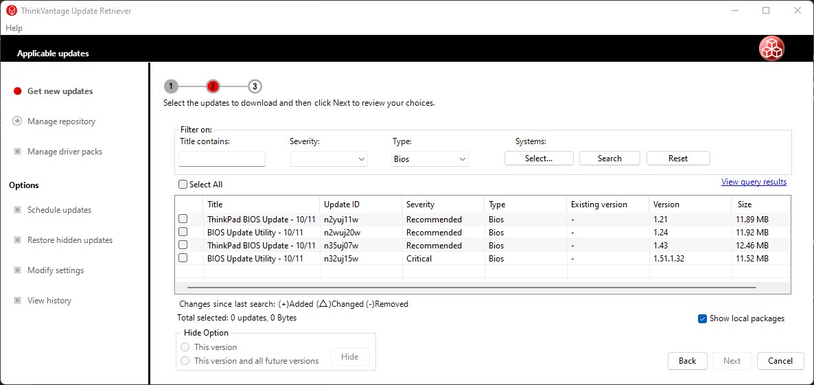
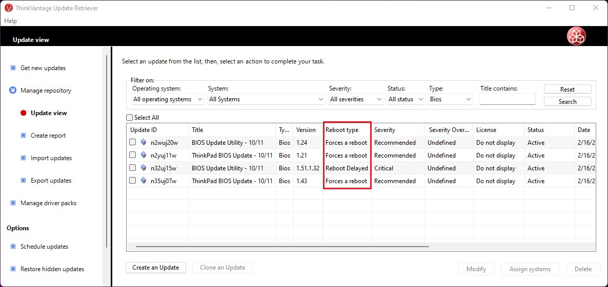

# Revisiting Update Retriever and Azure Blob Storage

---

This is a follow up to a previous [article](https://blog.lenovocdrt.com/#/2019/ur_az_blob) that walked through hosting an on-prem Update Retriever repository in an Azure Blob Storage.

If you've started leveraging cloud storage for your driver repository, this solution may be of interest to you if you're at a roadblock with how to deploy Bios updates to your endpoints.

The main focus of this article is a rather hot topic: **Silently installing Bios updates**.

Historically, Bios packages force a reboot and prompt the user to proceed with the update. In an enterprise, suppressing these prompts and preventing any forced reboots is extremely important.

This solution assumes you have an on-prem Update Retriever repository and Azure Blob Storage already in place. For authentication, I'm using a [Service Principal](https://docs.microsoft.com/azure/active-directory/develop/howto-create-service-principal-portal#register-an-application-with-azure-ad-and-create-a-service-principal), which the example script below is based off of.

?> Since we have to modify the packages, make sure your Update Retriever repository is configured as a **Local** repository.

Open Update Retriever, select the models you want to get updates for.

Filter by type, selecting **Bios**. Proceed to downloading the packages.



Once the packages are downloaded, under **Manage repository** > **Update view**, you'll see the **Reboot type** is either a **Forces a reboot** or **Reboot Delayed**. By default, the command line to install these packages is **winuptp.exe -r**, which results in the forced reboot.



With some PowerShell, we can save time by automatically altering the XML package descriptors to support a completely silent installation of Bios updates using Thin Installer. At this time, only ThinkPad is supported. The script can be found on [GitHub](https://github.com/philjorgensen/Azure/blob/main/Blob/Sync-Repositories.ps1).

```powershell
<#
.SYNOPSIS
  Syncs an on-prem Update Retriever repository to an Azure blob container using Azcopy.
.DESCRIPTION
  Prior to sync, the script recursively searches through the repository and parses through Bios xml's,
  which are altered to support silent Bios installation and not force the device to reboot after the update.
.PARAMETER RepositoryPath
  The on-prem Update Retriever repository path should be entered. Either a local drive or UNC path.
.EXAMPLE
  .\Sync-Repositories.ps1 -RepositoryPath "D:\Lenovo\Updates" -BlobPath "https://storageaccount.blob.core.windows.net/container/
.EXAMPLE
  .\Sync-Repositories.ps1 -RepositoryPath "\\server fqdn\share\Updates" -BlobPath "https://storageaccount.blob.core.windows.net/container/
.NOTES
Author: Philip Jorgensen
Created: 2-16-2022

  This script uses an Azure Service Principal for authentication. The Azure Service Principal variables should be
  set to match your environment's Service Principal or another method of authentication can be used if desired.

  The Azure Storage Account variables should be set to match your environment.

  The Az PowerShell module will be installed if not found on the system script is executed on.

  AzCopy will be downloaded to the TEMP directory and moved to ProgramData.

#>

param (
 [Parameter(Mandatory,
  HelpMessage = "Specify the local drive or UNC path to the Update Retriever repository...")]
 [string]$RepositoryPath,
 [Parameter(Mandatory,
  HelpMessage = "Specify the URL of the Blob Container to upload content to...")]
 [string]$BlobPath
)

# Set Azure Service Principal variables
$azureAppId = ""
$azureAppIdPasswordFilePath = ""
$azureAppCred = (New-Object System.Management.Automation.PSCredential $azureAppId, (Get-Content -Path $azureAppIdPasswordFilePath | ConvertTo-SecureString))
$subscriptionId = ""
$tenantId = ""

# Set Azure Storage Account variables
$storageAccountRG = ""
$storageAccountName = ""

########################################################################################
Clear-Host

# Check if Az module is installed
$installedModules = Get-InstalledModule
try {
 Write-Host "Checking for Az Module..." -ForegroundColor Green
 if ($installedModules.Name -notcontains "Az") {    
     
  # Update Az Module if needed
  Write-Host "Installing Az module..." -ForegroundColor Green
  Set-PSRepository -Name PsGallery -InstallationPolicy Trusted
  Install-Module -Name Az -Repository PSGallery -Force -AllowClobber
  Import-Module -Name Az -ErrorAction Stop -Verbose:$false
 }
 else {
  Write-Host "Importing Az Module..." -ForegroundColor Green
  Import-Module -Name Az -ErrorAction Stop -Verbose:$false
 }
}
catch [System.Exception] {
 Write-Warning -Message "Error: $($_.Exception.Message)"
 Break
}

# Connect to Azure
Write-Host "Logging on to Azure..." -ForegroundColor Green
Connect-AzAccount -ServicePrincipal -SubscriptionId $subscriptionId -TenantId $tenantId -Credential $azureAppCred

# Generate SAS token
# Valid for 1 hour by default (3600 seconds). Increase for initial sync.
$storageContext = (Get-AzStorageAccount -ResourceGroupName $storageAccountRG -AccountName $storageAccountName).Context
$SasToken = New-AzStorageAccountSASToken -Context $storageContext `
 -Service Blob, File, Table, Queue `
 -ResourceType Service, Container, Object `
 -Permission racwdlup `
 -ExpiryTime(Get-Date).AddSeconds(7200)

# Alter XML package descriptors if the Update Retriever repository is not a cloud repo
if (!(Get-Content -Path (Join-Path -Path $RepositoryPath -ChildPath "database.xml") | Select-String -SimpleMatch 'cloud="True"')) {
 Write-Host "Setting BIOS package XMLs for silent installation..." -ForegroundColor Green
 Get-ChildItem -Path $RepositoryPath -Recurse -Include *.xml |
 ForEach-Object { if (Get-Content $_ | Select-String -Pattern 'BIOS Update', 'EC Update') `
  {
   (Get-Content $_ | ForEach-Object { 
    $_  -replace 'winuptp.exe -r', 'winuptp.exe -s' `
     -replace 'Reboot type="1"', 'Reboot type="3"' `
     -replace 'Reboot type="5"', 'Reboot type="3"' 
   })
   | Set-Content $_
  }
 }
}

# Download AzCopy
Write-Host "Downloading the latest version of AzCopy..." -ForegroundColor Green
Invoke-WebRequest -Uri "https://aka.ms/downloadazcopy-v10-windows" -OutFile (Join-Path -Path $env:ProgramData -ChildPath AzCopy.zip) -UseBasicParsing
 
# Expand Archive
Expand-Archive -Path (Join-Path -Path $env:ProgramData -ChildPath AzCopy.zip) -DestinationPath (Join-Path -Path $env:ProgramData -ChildPath AzCopy) -Force -Verbose:$true
 
# Move AzCopy to ProgramData
Get-ChildItem -Path (Join-Path -Path $env:ProgramData -ChildPath "AzCopy\*\azcopy.exe") | Move-Item -Destination $env:ProgramData -Force
 
# Add azcopy to Windows environment path
[System.Environment]::SetEnvironmentVariable('PATH', $env:PATH + ';C:\ProgramData\')

azcopy.exe -v

Write-Host "Syncing repositories..." -ForegroundColor Green
azcopy.exe sync $RepositoryPath ($BlobPath + $SasToken) --delete-destination true

# Disconnect Azure Account
Write-Host "Disconnecting from Azure..." -ForegroundColor Green
Disconnect-AzAccount
```

After running the code, you should see the AzCopy statistics and a log file path for more details.


Refresh Update Retriever and you'll see the Reboot type is now **Requires a reboot** and the command line is **winuptp.exe -s**


As an example, the following Thin Installer command line will pull these packages down for install

```cmd
.\ThinInstaller.exe /CM -search A -action INSTALL -includerebootpackages 3 -noicon -repository https://storageaccount.blob.core.windows.net/bios-repository -noreboot -exporttowmi
```

?> Refer to the System Update Deployment Guide for Thin Installer usage: <https://docs.lenovocdrt.com/#/su/su_dg/su_dg>
