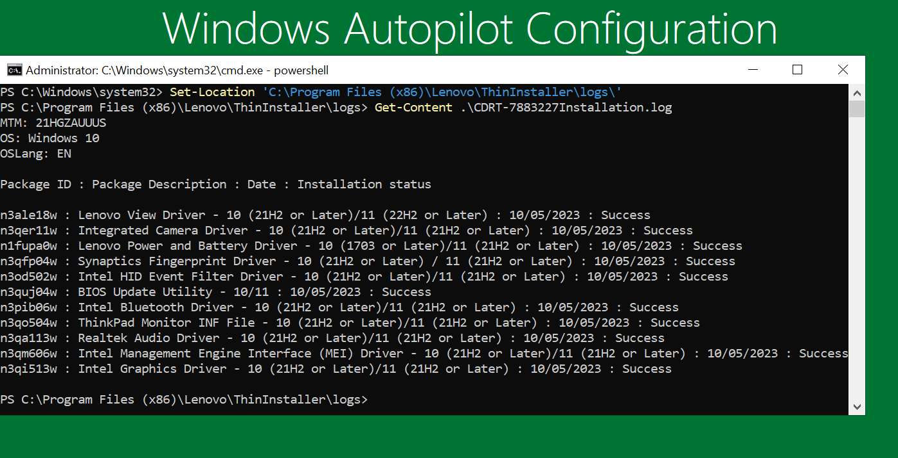

# Autopilot + Thin Installer = <br> Current Drivers/BIOS/Firmware

---

Revisiting a solution from [2020](https://blog.lenovocdrt.com/#/2020/ap_su) that leverages Lenovo System Update to update drivers during Autopilot which provided a way to ensure devices were up-to-date before handing off to end users.

Fast forward to this 2023 Configuration Manager [OSD solution](https://blog.lenovocdrt.com/#/2023/scripted_repo_creation) that will update drivers, BIOS, and firmware got me thinking: How awesome would it be to migrate this to Autopilot world and **really** provide users with completely up-to-date devices right out of the gate?

## Scenario

This solution works best when performing an Autopilot for [pre-provisioned deployment](https://learn.microsoft.com/autopilot/pre-provision). Depending on the number of applicable updates, especially BIOS or firmware, I have seen some systems take ~30 minutes to complete during my testing. As we all know, the goal of Autopilot is for the end user to have a quick and painless experience.

### Requirements

You'll need the following pieces to get started:

- Current version of Lenovo Thin Installer - Download [here](https://support.lenovo.com/solutions/HT037099)
- Win32 Content Prep tool - Download [here](https://github.com/microsoft/Microsoft-Win32-Content-Prep-Tool)
- Autopilot session detection script:

https://github.com/philjorgensen/Intune/blob/main/Autopilot/Thin%20Installer/Detect-AutopilotSession.ps1

- PowerShell script  **Get-LnvUpdates.ps1** for the magic: 

https://github.com/philjorgensen/Intune/blob/main/Autopilot/Thin%20Installer/Get-LnvUpdates.ps1

### Solution

Typically, [Update Retriever](https://docs.lenovocdrt.com/#/su/su_top) is used to download updates from the Lenovo Support site to a repository folder on a local drive or network share in which Thin Installer can be configured to search for and install updates from. This solution eliminates the need for Update Retriever and instead will build out the repository locally on the device followed by invoking Thin Installer to handle the installation of applicable updates.

#### Building the Win32 Applications

Create a folder structure for the source files.

- **C:\IntuneWin32\Source\ThinInstaller\lenovo_thininstaller_1.04.01.0004.exe**

- **C:\IntuneWin32\Source\Get-LnvUpdates\Get-LnvUpdates.ps1**

Use the Win32 Content Prep tool to create an .intunewin package for Thin Installer and Get-LnvUpdates

```cmd
IntuneWinAppUtil.exe -c "C:\IntuneWin32\Source\ThinInstaller\" -s lenovo_thininstaller_1.04.01.0004.exe -o C:\IntuneWin32\Output -q
```

```cmd
IntuneWinAppUtil.exe -c "C:\IntuneWin32\Source\Get-LnvUpdates\" -s Get-LnvUpdates.ps1 -o C:\IntuneWin32\Output -q
```

#### Adding the Apps

Login to the [Intune admin center](https://intune.microsoft.com/#view/Microsoft_Intune_DeviceSettings/AppsWindowsMenu/~/windowsApps) and add a new **Windows app (Win32)**. Select the **lenovo_thininstaller_1.04.01.0004.intunewin** app package file.

- Fill out the required App information fields and any optional fields.
- For Program information, specify the **Install command**

```dos

lenovo_thininstaller_1.04.01.0004.exe /verysilent /norestart
```

Since Thin Installer requires no installation and does not write anything to the Registry, simply removing the directory can be used for the **Uninstall command**

```dos
cmd.exe /c rmdir /s /q "C:\Program Files (x86)\Lenovo\ThinInstaller"
```

- Set the Install behavior to **System**

- Set the Operating system architecture to **64-bit** (you could tick both 32-bit as well but who's still deploying 32-bit Windows?)
- Set the Minimum operating system to **Windows 10 1607** (or whatever OS build you choose)
- Skip **Requirements**
- For Detection rules, choose **File** for the rule type and specify the following:
  - Path: **%ProgramFiles%\Lenovo\ThinInstaller**
  - File or folder: **ThinInstaller.exe**
  - Detection method: **File or folder exists**
  - Associated with a 32-bit app on 64-bit clients: **Yes**

Review + save to create the Thin Installer app

---

Let's create the second app. Repeat the above steps to add a new Win32 app, selecting the **Get-LnvUpdates.intunewin** app package file.

- The **Install command** will be calling the PowerShell script along with a handful of parameters to pass

?> Depending on your requirements, you can change the values for each parameter. For this solution, I'm essentially "throwing the kitchen sink" at the device so all applicable updates are installed.

```dos
powershell.exe -NoProfile -ExecutionPolicy Bypass -File ".\Get-LnvUpdates.ps1" -PackageTypes "1,2,3,4" -RebootTypes "0,3,5" -RT5toRT3 -Install
```

- There's really no need for an **Uninstall command** but since it's required. Just enter

```dos
cmd.exe /c
```

- Set the Install behavior to **System**
- Set the Device restart behavior to **Determine behavior based on return codes**. The script will flag Intune for a Soft reboot after the updates have been installed.
- On the Requirements section, add an additional Script requirement rule, specifying the **Detect-AutopilotSession.ps1** file. Since this is intended for Autopilot, we don't want this running post deployment when a user is logged in.
- For detection rules, we'll add another **File** rule type.
  - Path: **%ProgramFiles%\Lenovo\ThinInstaller\logs**
  - File or folder: **update_history.txt**
  - Detection method: **File or folder exists**
  - Associated with a 32-bit app on 64-bit clients: **Yes**

?> The update_history.txt is generated after Thin Installer has completed the update process.

Review + save to create the app. Once it's created, head back to the properties, add the Thin Installer app we created earlier as a dependency and configure it to **Automatically Install**.

#### Deploy

Deploy the **Get Lenovo Updates** Win32 app to a device group. Since this is intended for Autopilot devices, I'm going to deploy to a dynamic device group containing all of my Autopilot devices.

You'll also need to adjust the [Enrollment Status Page](https://learn.microsoft.com/autopilot/enrollment-status) (ESP) settings.

Under the **Block device use until required apps are installed if they are assigned to the user/device**, add the **Get Lenovo Updates** app to the list here.


#### Checking the Results

Prior to resealing the device and handing off to the user, you can review the results of the installation log found under **C:\Program Files(x86)\Lenovo\ThinInstaller\logs**

On my test device, you can see almost a dozen drivers have been updated, including the BIOS


