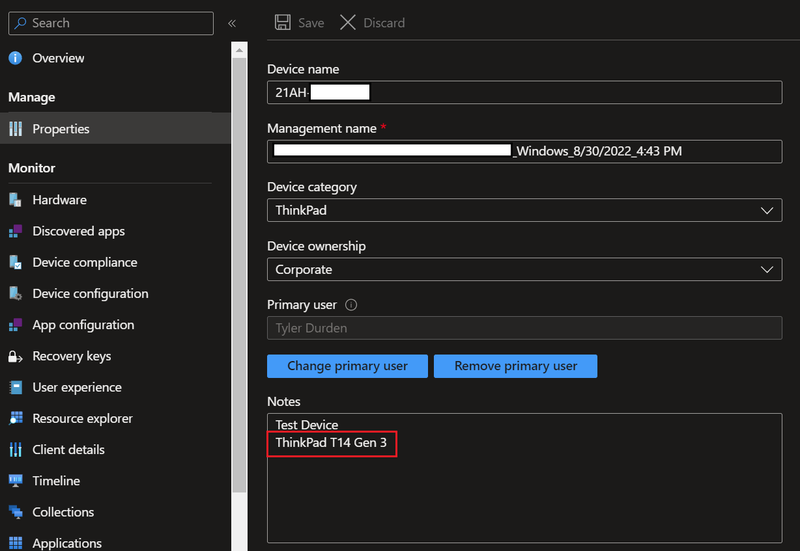

# Adding Model Friendly Name <br> to Intune Device Notes

---

As of today, there's still a limitation within the Intune portal to easily find the friendly name of a Lenovo system, i.e. **ThinkPad T14 Gen 3**. Instead, you're left with the Machine Type Model (**21AH**).

I'm sure there's a small group of people, if any, that have memorized what every MTM translates to for its respective friendly name.

To make this a bit easier, and with the help of Damien Van Robaeys' [blog post](https://www.systanddeploy.com/2023/01/get-list-uptodate-of-all-lenovo-models.html), we can use the Graph API to populate the device notes property of an Intune device by matching the **Model** (aka MTM) to its friendly name stored in this up-to-date [list](https://download.lenovo.com/bsco/schemas/list.conf.txt) used by our BIOS Simulator [tool](https://download.lenovo.com/bsco/index.html).

The below code can be used to accomplish this. If there's currently a note set for a device, the friendly name will be appended on the next line of the note. You can also download from my GitHub [here](https://github.com/philjorgensen/Graph/blob/main/Set-DeviceNoteFriendlyName.ps1).

?> This code was tested in a small tenant so results may vary as far as time to completion goes.

```powershell
Disconnect-Graph -ErrorAction SilentlyContinue
Connect-MgGraph -Scopes DeviceManagementManagedDevices.ReadWrite.All, Directory.Read.All
Select-MgProfile -Name beta

# Filter for Lenovo devices
$managedDevices = Get-MgDeviceManagementManagedDevice -Filter "Manufacturer eq 'LENOVO'"

<#

Variables for MTM to Friendly Name
https://github.com/damienvanrobaeys/Lenovo_Models_Reference/blob/main/MTM_to_FriendlyName.ps1

#>

$URL = "https://download.lenovo.com/bsco/schemas/list.conf.txt"
$Get_Web_Content = Invoke-RestMethod -Uri $URL -Method GET
$Get_Models = ($Get_Web_Content -split "`r`n")

foreach ($device in $managedDevices) {
    
    $deviceNotes = (Get-MgDeviceManagementManagedDevice -ManagedDeviceId $device.Id -Property "Notes").Notes
    $Mtm = $device.Model.Substring(0, 4).Trim()
    $FamilyName = ($Get_Models | Where-Object { $_ -like "*$Mtm*" }).Split("(")[0]
    
    if ([string]::IsNullOrEmpty($deviceNotes)) {

        # Update Device notes
        Update-MgDeviceManagementManagedDevice -ManagedDeviceId $device.Id -Notes $FamilyName

    }
    elseif ($deviceNotes -notmatch $FamilyName) {
        
        $appendDeviceNote = $deviceNotes + "`n$FamilyName"
        Update-MgDeviceManagementManagedDevice -ManagedDeviceId $device.Id -Notes $appendDeviceNote
    }
}

<#

# Output the results
foreach ($device in $managedDevices) {
    $deviceNotes = (Get-MgDeviceManagementManagedDevice -ManagedDeviceId $device.Id -Property "Notes").Notes
    Write-Output -InputObject "$($device.DeviceName) is a $($deviceNotes)"
}

#>
```

Once finished, check a device's notes in the portal to find it's friendly name.


