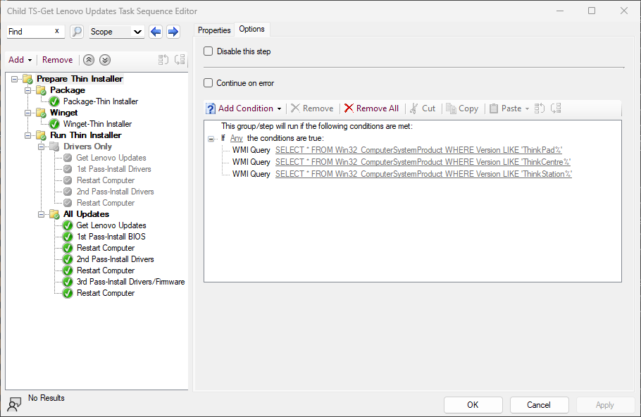
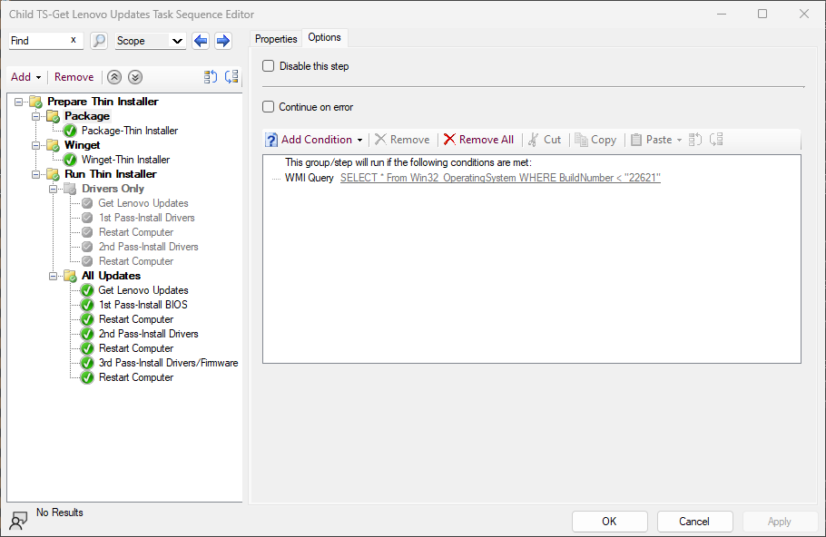
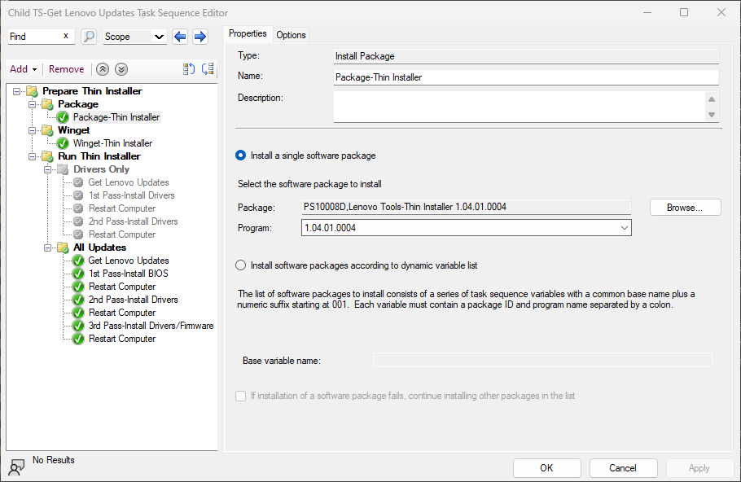
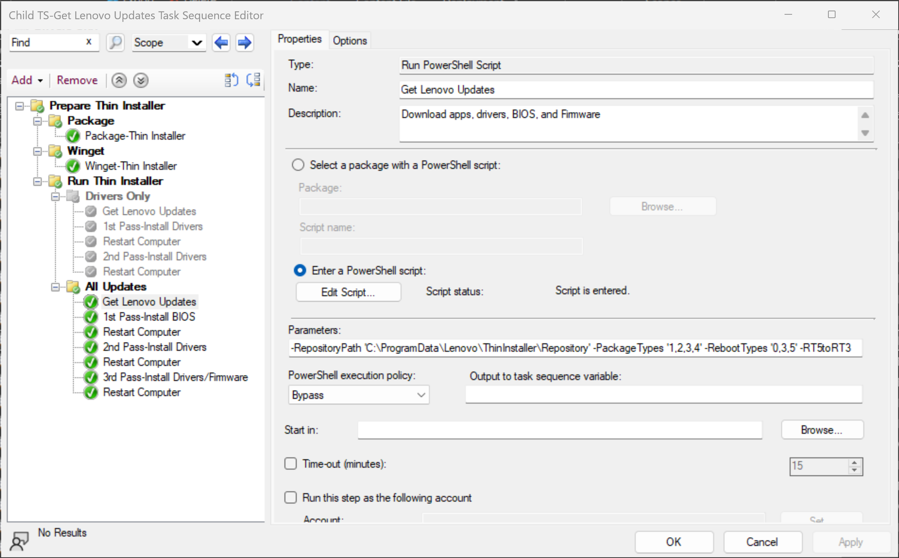
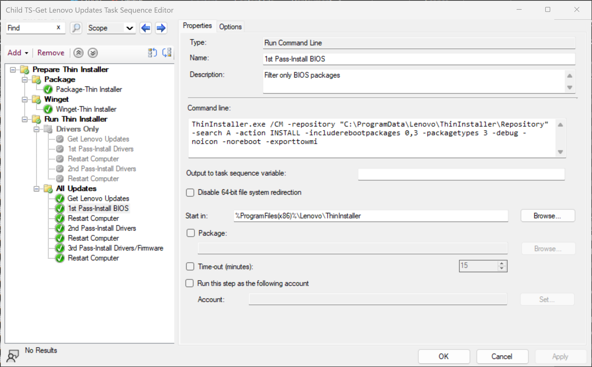

# Creating Local Repository <br> Using PowerShell

---

There are various scenarios where one might want to quickly generate a local repository of Lenovo updates that can be consumed by Thin Installer or System Update in a scripted manner. This article will describe a PowerShell script that can be leveraged to create a repository for a specified machine type and OS. A couple of scenarios where this script might be used will also be described.

The script, **Get-LnvUpdatesRepo.ps1**, can be found in the CDRT Library repository on GitHub [here](https://github.com/CDRT/Library).

The child task sequence can be downloaded [here](https://download.lenovo.com/cdrt/GetLenovoUpdates.zip).

## Scenario 1

In the first scenario, Thin Installer will be leveraged in an OS deployment task sequence to apply any applicable updates available for the machine type of the targeted system. For this approach, a PowerShell script will be executed in the task sequence to control creation of the repository for the first time which can be skipped if the repository already exists. Each machine type will have its own repository folder in this scenario.

### Child Task Sequence Workflow

Child task sequence will be added after the **Setup Windows and Configuration Manager** step in your parent Operating System Deployment task sequence

The top level group **Prepare Thin Installer** queries the device to determine if it is a Think product.


WQL query to check if the Operating System build is 22H1 or earlier. Thin Installer is installed using a legacy Package



WQL query to check if the Operating System build is 22H2 or later. This group contains a step to leverage Winget that's installed as part of the Microsoft.DesktopAppInstaller package to install Thin Installer from the Winget repository. Windows 11 22H2 contains Winget automatically.


PowerShell script to install Thin Installer

```powershell
$Winget = Get-ChildItem -Path (Join-Path -Path (Join-Path -Path $env:ProgramFiles -ChildPath "WindowsApps") -ChildPath "Microsoft.DesktopAppInstaller*_x64*\winget.exe")

try {
     & $Winget install --id Lenovo.ThinInstaller -h --accept-source-agreements --accept-package-agreements --log C:\ProgramData\Winget-InstallThinInstaller.log
}
catch {
    return $_.Exception.Message; Exit 1
}
```

PowerShell script **Get-LnvUpdatesRepo.ps1** will download current updates from Lenovo's servers and store on the device. Parameters are supplied to specify the repository path and package types to download


?> The **All Updates** group contains the necessary parameters and Thin Installer command line to include Reboot Type 5 packages (BIOS/Firmware). The **Drivers** group will only download Reboot Type 3 packages (Drivers), and is disabled by default.

Once all content is downloaded to the device, 2 passes of Thin Installer (with a reboot in between) installs all updates to ensure the device is current.


### Summary

With this scenario, the repository folders for the models being deployed can be created outside of the task sequence and can be recreated on a regular basis to ensure the latest content is included. Then as each device is imaged, the Thin Installer task can apply the applicable updates to ensure the final device is current.

If BIOS and firmware updates are included which will force a reboot (reboot type 1) or force a delayed reboot (reboot type 5) then the task sequence will be interrupted. Therefore, it would be best in a task sequence scenario to exclude packages of these reboot types. This can done by using the parameter "-includerebootpackages 3" in the Thin Installer command.
