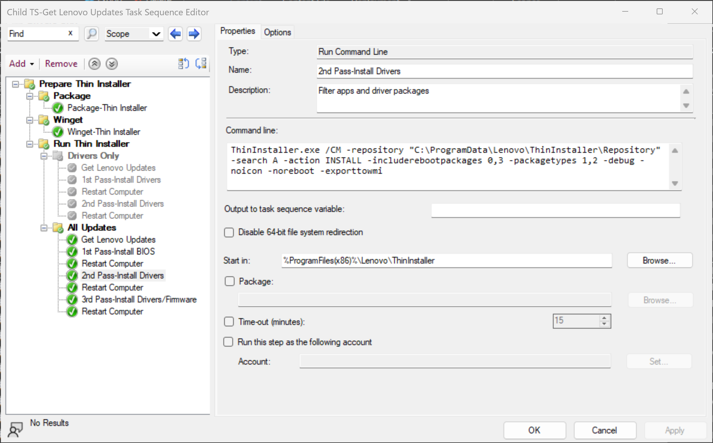
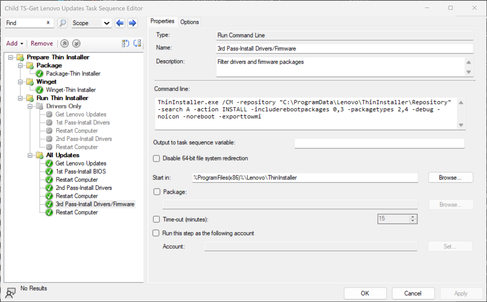

# Creating Local Repository <br> Using PowerShell

---

There are various scenarios where one might want to quickly generate a local repository of Lenovo updates that can be consumed by Thin Installer or System Update in a scripted manner. This article will describe a PowerShell script that can be leveraged to create a repository for a specified machine type and OS. A couple of scenarios where this script might be used will also be described.

The script, **Get-LnvUpdatesRepo.ps1**, can be found in the CDRT Library repository on GitHub [here](https://github.com/CDRT/Library).

The child task sequence can be downloaded [here](https://download.lenovo.com/cdrt/eval/GetLenovoUpdates.zip).

## Scenario 1

In the first scenario, Thin Installer will be leveraged in a Microsoft Endpoint Configuration Manager Operating System Deployment task sequence to apply any applicable updates available for the machine type of the targeted system. For this approach, a PowerShell script will be executed in a child task sequence to orchestrate the creation of the repository with the desired updates which can be customized based on Package Types and Reboot Types.

### Child Task Sequence Workflow

The child task sequence will be added after the **Setup Windows and Configuration Manager** step in your parent Operating System Deployment task sequence

The top level group **Prepare Thin Installer** queries the device to determine if it is a Think product.


WQL query to check if the Operating System build is 22H1 or earlier. Thin Installer is installed using a legacy Package


WQL query to check if the Operating System build is 22H2 or later. This group contains a step to install Thin Installer from the Winget repository. Windows 11 22H2 contains Winget automatically while earlier versions of Windows must install Winget from the Microsoft.DesktopAppInstaller package.


PowerShell script to install Thin Installer:

```powershell
$Winget = Get-ChildItem -Path (Join-Path -Path (Join-Path -Path $env:ProgramFiles -ChildPath "WindowsApps") -ChildPath "Microsoft.DesktopAppInstaller*_x64*\winget.exe")

try {
     & $Winget install --id Lenovo.ThinInstaller -h --accept-source-agreements --accept-package-agreements --log C:\ProgramData\Winget-InstallThinInstaller.log
}
catch {
    return $_.Exception.Message; Exit 1
}
```

PowerShell script **Get-LnvUpdatesRepo.ps1** will download current updates from Lenovo's servers and store on the device. Parameters are supplied to specify the repository path, package types and reboot types to download:

```cmd
-RepositoryPath 'C:\Program Files (x86)\Lenovo\ThinInstaller\Repository' -PackageTypes '1,2,3,4' -RebootTypes '0,3,5' -RT5toRT3
```


?> The **All Updates** group contains the necessary parameters and Thin Installer command line to include Reboot Type 5 packages (BIOS/Firmware). The **Drivers** group will only download Reboot Type 3 packages (Drivers), and is disabled by default.

Once all content is downloaded to the device, 3 passes of Thin Installer (with a reboot in between) installs all updates to ensure the device is current.

### First Pass


If a BIOS update is applicable, this package gets installed first using this Thin Installer command line

```cmd
ThinInstaller.exe /CM -search A -action INSTALL -includerebootpackages 0,3 -packagetypes 3 -noicon -noreboot -exporttowmi
```

### Second Pass



Only drivers and apps are filtered for installation using this command line

```cmd
ThinInstaller.exe /CM -search A -action INSTALL -includerebootpackages 0,3 -packagetypes 1,2 -noicon -noreboot -exporttowmi
```

### Final Pass



Firmware packages, such as Intel ME Firmware, are installed in the final pass using this command line

```cmd
ThinInstaller.exe /CM -search A -action INSTALL -includerebootpackages 0,3 -packagetypes 2,4 -noicon -noreboot -exporttowmi
```

***NOTE:*** In some cases, typically with Thunderbolt, there may be a requirement that the latest driver needs to be installed *BEFORE* the firmware can be updated. This pass will include drivers and firmware to only be installed.

### Summary

With this scenario, there is very little effort needed to manage multiple models. This approach does download the updates on each device being deployed which may be a redundant use of network bandwidth to the Internet. However, this approach works very well for in a scenario where the device is being reimaged off-site.

This approach could be modified easily to incorporate a centralized network storage for the repository so that multiple devices could share the same content. The **Get-LnvUpdatesRepo.ps1** script could be called from an admin's machine to create repository folders for each machine type. The script in the task sequence could then be modified to call Thin Installer with a -repository parameter pointing to the correct machine type folder.

Normally, if BIOS and firmware updates are included which will force a reboot (reboot type 1) or force a delayed reboot (reboot type 5) then the task sequence will be interrupted. Most current Lenovo ThinkPad, ThinkCentre and ThinkStation products have switched to using Reboot Type 5 for BIOS updates. Therefore, the **Get-LnvUpdatesRepo.ps1** script has an option, **-RT5toRT3**, which changes the Reboot Type to 3 instead of 5. This, in combination with the **-noreboot** parameter of Thin Installer, allows the updates to be applied with ConfigMgr controlling the restart.
