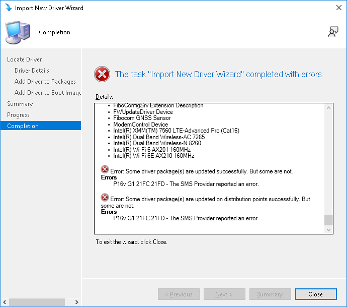

# MECM - Driver Import Error: <br> "Some packages cannot be updated"

---

Recently we have experienced an increase of reported issues when importing drivers into Configuration Manager.  After a successful import, the import wizard goes to copy the drivers to the package and distribute the package to the distribution point(s), yet an error is received.



While there is no issue with the import process, the process to update driver packages where the content is stored fails.

## Cause

The cause of the issue is the source location containing the driver files is missing, yet the driver is still present in Configuration Manager, expecting to be referenced by the new package.

## Remediation

Unfortunately, the error listed does not define the missing driver(s) responsible for the failure.  To locate these drivers, I have written a PowerShell script to test the presence of the folder location listed for each driver.  If the location is not present, I output the missing driver's CI_ID, Name, and Content Source Location.  Once the drivers with missing content source locations are identified, you can either replace the missing content or delete the drivers from the database.  Each of these options present their own unique issues.
- Replacing the content, will result in obtaining the original content, which may not be available any longer resulting in deleting the drivers.
- Deleting the drivers from the Configuration Manager console will ultimately remove these drivers from existing packages, causing Operating System Deployment Task Sequences to miss drivers in the Operating System.  When deleting, you may have to revalidate the drivers and deployment.

### Script

```PowerShell
#Get All Drivers in CM
$CMDrvs = Get-CMDriver -Fast | ? {$_.ContentSourcePath -ne ""}
ForEach($CMDrv in $CMDrvs){
    # Iterate through all the drivers testing the existence of the source path
    If((Test-Path "FileSystem::$($CMDrv.ContentSourcePath)") -eq $False){

     # Outputting relevant information to console
        Write-Host "CI_ID: $($CMDrv.CI_ID) - Driver: $($CMDrv.DriverProvider) $($CMDrv.LocalizedDisplayName) missing folder $($CMDrv.ContentSourcePath)"
    }
}
```
